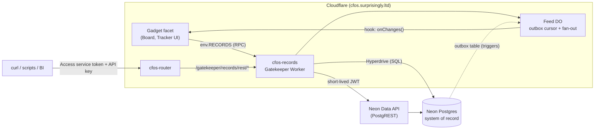

# Alternative: an external Postgres "records service" with a headless API

> **Superseded (2026-09-23)** by [Organisation datastores: implementation plan](organisation-datastores.md).
> Retained as historical design input, not current implementation instructions. The replacement
> selects a domain service, separates publication from provisioning, adds organisation ownership
> and a registry, requires trusted caller identity, and corrects the outbox cursor design.
> See [research and decisions](../research/organisation-datastores-decisions.md).

Written 2026-09-23 against starter `main` 3157780 and submodule e50a9058. Status: **proposal, nothing built**. This plan is an alternative to [`gadget-http-api.md`](gadget-http-api.md), which serves HTTP through a Gatekeeper hook and has been reviewed in [`../research/gadget-http-api-recommendations.md`](../research/gadget-http-api-recommendations.md). Evidence for the platform facts is in [`../research/gadget-http-api-options.md`](../research/gadget-http-api-options.md).

## The idea in one picture

Move the **system of record** out of gadget Durable Objects and into a managed Postgres (Neon by default). The gadgets become UIs over it. The command line, scripts, BI tools and other services all use the database's REST API (PostgREST-compatible) directly. None of that traffic goes through a gadget.



## Why consider it (and why not DO→Postgres CDC)

**About the CDC idea as proposed.** A Durable Object's SQLite has **no public change feed**. Its WAL is streamed to object storage only for point-in-time recovery. "CDC out of a gadget" would therefore be an app-written outbox inside each gadget, pushed through a gatekeeper. That leaves two systems of record, one SQLite silo per workspace with its own schema, conflicts whenever the API writes back, and a sync path to maintain for every gadget. It only works as a **one-way mirror** for reporting (Variant B below). For "a Jira you own", flip the direction: Postgres is the truth, and gadgets read and write through a gatekeeper.

| | Gatekeeper-hook HTTP API (current plan) | External records service (this plan) |
| --- | --- | --- |
| Where the data lives | A SQLite silo per gadget (10 GB cap), invisible to SQL tools | One Postgres: backups, PITR, branching, cross-workspace queries, BI |
| API | Custom, routed through gadget code, limited to about 45–50 calls a second per gadget | PostgREST: filtering, paging, embedding, OpenAPI for free. Scales with the database, not the gadget. |
| Where business rules live | Gadget JS | **The database**: constraints, RLS, triggers, `api` views/functions. This is the main cost. |
| Live collaboration | Native (DO push) | Outbox polling or push, with about 1–2 s latency. Presence and cursors stay in the DO. |
| Riskiest unknown | Whether a hook can return a value (review P0-1) | RLS correctness, and residency and cost of an outside vendor |
| Data leaves Cloudflare | No | Yes (Neon/AWS). Pick an EU region. It's a compliance decision. |
| Migrations | Code edits per gadget, no schema tooling | Versioned SQL, tested on Neon branches, with a stable versioned `api` schema |
| Cost | Workers + DO | + Neon (or RDS). Hyperdrive has no egress or pooling charges. |

**Recommendation:** use this plan for **enterprise-shaped data** (projects, issues, customers, anything shared across workspaces or needed outside the app). Keep the hook plan, or plain DO storage, for **gadget-local state** (whiteboards, docs, presence). The two plans can coexist.

## Components

1. **Postgres, Neon by default.** It is serverless and scales to zero, branches per migration or PR, and has a managed [Data API](https://neon.com/docs/data-api/overview) that re-implements PostgREST, validates JWTs from any JWKS and enforces RLS. Plain Postgres alternatives work unchanged: Supabase (PostgREST built in), AWS RDS/Aurora with self-hosted PostgREST, or PlanetScale Postgres. Only the Data API endpoint and JWT config change.
2. **`packages/gatekeeper-records`**, a Gatekeeper Worker with:
   - a **Hyperdrive** binding to Postgres, used for gadget RPC and the outbox poll ([Hyperdrive](https://developers.cloudflare.com/hyperdrive/) pools in **transaction mode**; `SET LOCAL` inside a transaction is supported);
   - `GatekeeperVendor` with one resource, **Record space** (`${BASE}/space/<slug>`), suggested binding `RECORDS`. A space is a tenant key: every row carries `space_id` and RLS keys on it;
   - an HTTP front door at `/gatekeeper/records/rest/*` that authenticates the caller, mints a 60-second JWT (`role`, `space_id`, `actor`) with its own key, and forwards the request to the Data API. It serves its public JWKS at `/gatekeeper/records/.well-known/jwks.json` for the Data API to trust;
   - the **Feed DO** (one per space), which tails the outbox and delivers changes to gadget hooks.
3. **`packages/records-schema`**, which holds migrations and the API contract (see Data model).
4. **CLI**: plain curl, or any PostgREST client such as `@supabase/postgrest-js` or `postgrest-py`, pointed at `https://cfos.surprisingly.ltd/gatekeeper/records/rest`.

### Gadget read/write path

```mermaid
sequenceDiagram
  participant G as Gadget (server.js)
  participant GK as records Gatekeeper
  participant Q as Approval queue
  participant PG as Postgres (via Hyperdrive)
  G->>GK: RECORDS.select("issues", {status:"open"})
  GK->>Q: authorizeObservation (one per call, no row data)
  GK->>PG: BEGIN; SET LOCAL role app_gadget; SET LOCAL app.space_id=…; SET LOCAL app.actor=…; SELECT … ; COMMIT
  PG-->>G: rows (RLS-filtered)
  G->>GK: RECORDS.mutate([{op:"update", table:"issues", id, patch, ifVersion}])
  GK->>Q: submit action {actionKind:{tag:"records.write"}, autoApprovable:true}
  Q-->>GK: approved (owner pre-approved the kind) → applyAction
  GK->>PG: one transaction; trigger writes audit + outbox rows
```

### External API path and change feed

```mermaid
sequenceDiagram
  participant C as CLI
  participant GK as records Gatekeeper
  participant D as Neon Data API
  participant PG as Postgres
  participant F as Feed DO
  participant G as Gadget hook
  C->>GK: PATCH /gatekeeper/records/rest/issues?id=eq.42 (Access svc token + Bearer key)
  GK->>GK: verify Access JWT (own AUD) + API key hash → space, grants
  GK->>D: same request + Authorization: Bearer <60s JWT {role, space_id, actor}>
  D->>PG: SET role / request.jwt.claims; UPDATE api.issues … (RLS + triggers)
  PG-->>C: 200 JSON
  F->>PG: alarm every 1–2 s while subscribers exist: SELECT … FROM outbox WHERE seq > cursor
  F->>G: initiator.startHook() → callback.onChanges(batch)
```

## Data model: flexible but migratable

- **Two schemas.** `core` holds the tables, which are never exposed. `api_v1` holds the views and functions that PostgREST exposes. Refactor `core` freely and keep `api_v1` stable. A breaking change ships as `api_v2` alongside the old version. The Data API exposes only `api_v*`.
- **Typed columns for known fields** (`issues.title`, `status`, `assignee`, `version`), plus **`attributes jsonb` for custom fields**. A `field_definitions` table (space, entity, key, type, options, required) holds Jira-style custom fields, and a validation trigger checks `attributes` against it. A popular custom field graduates to a real column through a normal migration.
- **Required on every table:** `id uuid`, `space_id`, `version int` (optimistic concurrency via `ifVersion`), `created_at/by` and `updated_at/by`. `actor` is taken from `app.actor` or the JWT claim, never from the payload.
- **Audit and outbox:** one generic `AFTER` trigger writes `core.changes(seq bigserial, space_id, entity, id, op, version, actor, at, diff jsonb)`. The same table is both the audit trail and the feed. Trim it with a retention job, except for audit records kept for compliance.
- **Migrations:** plain SQL files under `packages/records-schema/migrations`, applied by one tool. Use [dbmate](https://github.com/amacneil/dbmate) for simplicity, or Atlas if you want declarative diffs. CI flow: create a Neon branch → apply → run pgTAP/RLS tests → delete the branch. Production runs from `pnpm records:migrate`, never from the Worker. After a migration, reload the PostgREST schema cache (`NOTIFY pgrst, 'reload schema'` for self-hosted; check the Data API's equivalent).
- **Roles:** `records_owner` (migrations only). `app_gadget` and `app_api` are both `NOLOGIN`, reached through `SET ROLE` or the JWT `role` claim, and are limited to `api_v1` with RLS. `records_gatekeeper` is the Hyperdrive login and may only `SET ROLE` to the two app roles. RLS policies are `space_id = current_setting('app.space_id')::uuid` (or the JWT claim) on every table, and a test fails if any `core` table lacks RLS.

## Security and identity

- **One front door:** the router and Access. The CLI needs an Access service token, admitted by a **path-specific Access app** for `/gatekeeper/records/rest/*` with its own AUD (the review's P0-3 applies unchanged), plus a records API key. Keys are minted in the gatekeeper's configurator, stored as SHA-256, scoped to one space and a grant (`read`, or `read+write` on named `api_v1` objects), and default to a 90-day expiry.
- **The Data API only trusts JWTs the gatekeeper mints.** Direct calls to the Neon endpoint without such a JWT get nothing, because there is no anonymous role. Neon's endpoint stays reachable on the internet: treat the JWT signing key as a production secret (Worker secret, rotated through JWKS `kid`).
- **Gadget writes are platform actions** (`actionKind: records.write`, auto-approvable once the owner pre-approves). Observations carry counts and entity names, never row data (review P0-4). Batch a UI save into one `mutate([...])` so it creates one action, not one per field.
- **Attribution:** gadget calls carry the viewer from the fork's `gadgetViewer` patch, which becomes `app.actor`. API calls carry `key:<label>`, which is never shown as a person.

## Gadget contract (sketch for `types.d.ts`)

```ts
export interface RecordsSession {
  describe(): Promise<{ space: string; entities: EntitySchema[] }>;   // from api_v1 + field_definitions
  select(entity: string, q?: { where?: Filter; order?: string; limit?: number; after?: string }): Promise<Page>;
  get(entity: string, id: string): Promise<Row | null>;
  mutate(ops: Op[], opts?: { idempotencyKey?: string }): Promise<{ results: Row[] }>;  // one tx, one action
  /** Persistent stub from ctx.restore(); one per (gadget, key). Idempotent by key (review P0-2). */
  subscribe(key: string, handler: RpcStub<RecordsHook>, entities?: string[]): Promise<{ cursor: string }>;
}
export interface RecordsHook { onChanges(batch: { cursor: string; changes: Change[] }): Promise<void>; }
```

The gadget keeps a small DO cache and presence state. On `onChanges` it refreshes and pushes to its viewers through the existing live-push plumbing. If a delivery is missed, the gadget calls `select` again from its stored cursor.

## Variant B: one-way mirror for existing gadgets

For gadgets whose truth stays in the DO (Board today), add an optional `mirror` resource. The gadget writes an outbox in its own SQLite in the same transaction as the change. An alarm pushes batches through `RECORDS.mirror(batch)` as idempotent upserts keyed by `(space, entity, id, version)`. Postgres is **read-only** for these entities (RLS denies writes to `app_api`). This covers reporting and CLI reads without the two-master problem. Writes from outside still go through the hook plan.

## Files

| Path | Contents |
| --- | --- |
| `packages/records-schema/` | `migrations/*.sql`, `tests/*.sql` (pgTAP: RLS on every table, role grants, trigger behavior), `seed/`, `scripts/migrate.ts`, README |
| `packages/gatekeeper-records/src/vendor.ts`, `configurator/` | Vendor and Record space resource, space creation, API key mint/revoke (show once), guided status. Copy the structure from `packages/gatekeeper-websearch` and `packages/gatekeeper-chat/src/vendor/`, and the ownership chain from email's `UserAccount`/`GatekeeperUserImpl` (review: don't trust a configurator-supplied account id). |
| `src/session.ts` | `RecordsSessionImpl`, query builder (identifier allow-list from `describe()`, parameterised values only), `mutate` → action → `applyAction` transaction |
| `src/rest-proxy.ts` | Access verify (own AUD), key check, JWT mint (`jose`, ES256), forward to the Data API, strip hop-by-hop, auth and `cf-*` headers, response byte cap |
| `src/feed-do.ts` | Cursor per subscriber, alarm poll (backoff to 30 s when idle, stop when no subscribers), `startHook()` per delivery and `using` disposal, at-least-once with cursor |
| `src/db.ts` | `postgres` (postgres.js) over `env.HYPERDRIVE.connectionString`. `withSpace(spaceId, actor, role, fn)` wraps `BEGIN … SET LOCAL … COMMIT`. |
| `deployment.jsonc` | `workers.records`, and `"records": { enabled:false, hyperdriveId, dataApiUrl, access:{issuer,audience}, pollMs:1500 }` |
| `scripts/deploy.ts` / `deployment-config.ts` / tests | Worker plus Hyperdrive binding, router and Workshop `GATEKEEPER_RECORDS` bindings (as `GATEKEEPER_CHAT`, `:641` and `:723`), validation |

Secrets, never in the repo: `JWT_PRIVATE_KEY` (Worker secret), the Postgres password (inside the Hyperdrive config only, `wrangler hyperdrive create`), and the Neon API key for CI branching (CI secret).

## Phases

0. **Spike (kill gate):** create a Neon project (EU region) and a Hyperdrive config. From a Worker, run `SET LOCAL` role and claims plus an RLS-filtered select through Hyperdrive. Make the Data API accept a gatekeeper-minted JWT from our JWKS with a custom `role` and `space_id`. Measure p50/p95 latency from Cloudflare London. If Hyperdrive blocks `SET LOCAL ROLE` or the Data API won't take our JWKS, fall back to self-hosted PostgREST (Fly, or Cloudflare Containers) and record why.
1. **Schema package:** roles, RLS, `changes` trigger, `issues`/`projects` demo entities, `field_definitions`, pgTAP suite, branch-per-CI.
2. **Gatekeeper core:** vendor, space ownership, `select`/`get`/`mutate` with actions. Unit tests with a stubbed `db.ts`, and an integration test against a Neon branch.
3. **REST front door:** Access (own app), API keys, JWT mint, proxy, error mapping (use the review's problem+json format). Negative tests: no key, wrong space, expired, a token for `/api`.
4. **Feed:** outbox poll, hook subscribe (idempotent by key), delivery and disposal, missed-delivery recovery.
5. **Showcase:** a "Tracker" blueprint (projects and issues with custom fields) on `RECORDS`, plus a README curl walkthrough.
6. **Optional:** Variant B mirror for Board, and a warehouse export via logical replication (Sequin/Debezium) if analytics needs it.

## Known limits and gotchas

- **Latency:** every gadget read is a network hop to the database's region (tens of ms from a nearby colo; Hyperdrive can cache reads, but turn caching off for RLS-scoped queries unless the cache key includes the claims). The UI should cache in the DO.
- **LISTEN/NOTIFY is not available through Hyperdrive's transaction pooling,** so the feed polls. The poll cost is one small indexed query per active space every 1.5 s, stopping when idle.
- **Hyperdrive limits** (Paid): about 100 pooled connections per config, 60 s query cap, 25 configs per account ([limits](https://developers.cloudflare.com/hyperdrive/platform/limits/)). Check Free-plan query caps before relying on it.
- **Security depends on RLS being correct.** An API role that can reach a `core` table without RLS is a cross-tenant leak, so the pgTAP check is a release gate. Never let a payload supply `space_id` or `actor`.
- **Gadget platform gotchas still apply** to the Feed hook (store the initiator, never the callback; dispose; no `dup()` on service stubs; run in the platform process locally) and to action volume. See the review's P0/P1 items.
- **Vendor lock-in is small:** everything is plain Postgres plus the PostgREST protocol. Moving from Neon to RDS means changing the Hyperdrive origin and self-hosting PostgREST.

## Sources

- Neon Data API (PostgREST-compatible, JWT/JWKS, RLS): <https://neon.com/docs/data-api/overview>, <https://neon.com/blog/a-postgrest-compatible-data-api-now-on-neon>
- Hyperdrive pooling (transaction mode, `SET` supported): <https://developers.cloudflare.com/hyperdrive/concepts/connection-pooling/>
- PostgREST (auth, schema cache, roles): <https://postgrest.org/>
- Durable Object SQLite storage (PITR, no change-feed API): <https://developers.cloudflare.com/durable-objects/api/sqlite-storage-api/>
- Gatekeeper action auto-approval contract: `cloudflare-os/packages/workshop-shared/src/gatekeeper.ts:723-747`, `:1135`
- Upstream's Supabase gatekeeper (admin-style, every write needs approval, so not a datastore): `cloudflare-os/packages/gatekeeper-supabase/README.md`
