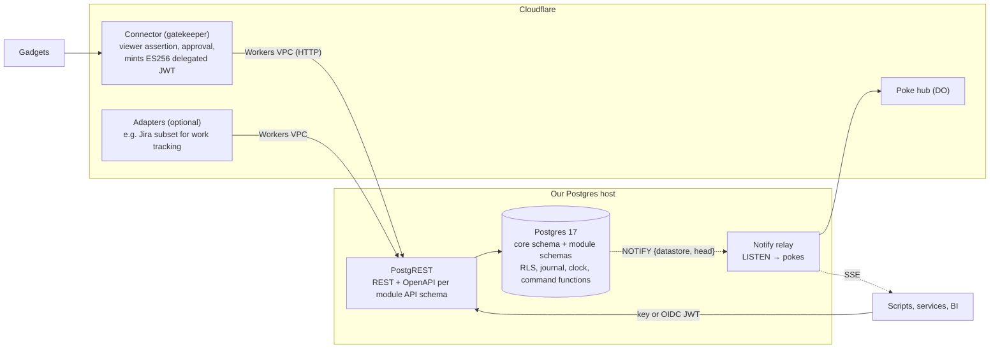

# App datastore service: reframing

> **Records direction superseded — 2026-09-25.** The current recommendation and delivery plan is [Records: shared application data](records-direction.md). This document is retained as historical research, implementation evidence or a separate gadget-HTTP proposal; it is not the specification for the new Records service. Existing deployment records remain historical facts, not instructions to deploy the new design.

Written 2026-09-25 against starter `main` `1343158`. Status: **current framing; architecture decision
pending with the owner. Nothing in this document has been implemented.** It supersedes the product
framing of [canonical-postgres-datastore.md](canonical-postgres-datastore.md),
[organisation-datastores.md](organisation-datastores.md) and their research, but not their mechanisms.

## 1. What this service is for

The purpose was misread in the 2026-09-24 plans, so it is set down here first.

We are building a **generic app datastore service for cloudflare-os**. Its job is to hold data that
must outlive a single gadget or be shared beyond one: data that should not be split across many Durable
Objects. The first uses are our own business data:

- Jira-like work tracking: projects, work items, workflow, comments.
- Slack-like messaging: channels, threads, messages, reactions.

The commercial point is to stop paying for Jira, Confluence, Slack, Miro and similar tools. We replace
them with cloudflare-os front ends (gadgets built from blueprints) over data models we own, stored in
Postgres we host.

A developer uses the service like this:

1. Define a **module**: a data model with its permissions, commands and events.
2. **Publish** it together with a **connector** (a cloudflare-os gatekeeper) and one or more
   **blueprints** that use it, such as a kanban board, a quarterly-progress report or a velocity chart.
3. Publishing runs the module's migrations. Organisations then create **datastores** (instances of the
   module), and gadgets connect to them.

The service should be more opinionated than a headless CMS or a general backend-as-a-service, and much
easier to use from cloudflare-os. In particular, it should build in cloudflare-os identity, approvals,
an immutable history and optimistic sync.

### What it is not

- **It is not a Jira product, and never was meant to be one.** Jira is to this service what Jira is to
  Postgres: one shape a client might want. A work-tracking module *may* ship an optional
  Jira-compatible adapter so existing scripts keep working. A messaging module *may* ship a Slack- or
  Mastodon-shaped adapter. Adapters are add-ons owned by one module and never drive the core.
- **It is not tied to Neon.** Neon hosted the first deployment. Production is expected to run on
  Postgres we host.
- **It is not a lake or a mirror of gadget storage.** Both were rejected on 2026-09-24 and stay
  rejected.

## 2. Words used in this document

| Term | Meaning |
| --- | --- |
| Service core | What every module shares: registry, organisations, principals, memberships, credentials, identity, journal, clock, idempotency, sync, change notifications, webhooks, audit, operations |
| Module | A versioned data model: tables, API contract, permissions (scopes), commands, events, sync keys, redactable fields, and optionally adapters and client-side predictors. Authored by developers and published |
| Datastore | One instance of a module, owned by an organisation. It has its own members, its own clock and its own history |
| Connector | The cloudflare-os gatekeeper that lets gadgets bind to datastores. There is one generic connector for all modules today (`gatekeeper-records`) |
| Blueprint | A cloudflare-os app template. It declares the module and API major it needs (`service-requirement.json`) |
| Adapter | An optional, module-owned compatibility surface, such as a Jira REST subset over a work-tracking module |

## 3. What changes from the previous framing

| Topic | Previous framing (2026-09-24) | This framing |
| --- | --- | --- |
| The product | "Organisation datastores", with Projects as *the* module and a Jira-compatible API as a headline | A generic app datastore. Work tracking and messaging are the first two modules |
| Jira | Designed into the core plan (§7 of the canonical plan), with Jira ids on core tables and `via = 'jira'` in the core | An optional adapter package for the work-tracking module only |
| Adding a module | Described but not possible: nothing dispatches by module (see §4) | The central feature. A module is a publishable package |
| Hosting | Neon plus Hyperdrive | Any Postgres 17. Self-hosted in production; Neon is acceptable for development |
| API | Hand-written TypeScript routes and OpenAPI for Projects | Generated or generic per module (§6 compares two ways) |
| Realtime | Durable Object poke hub, fed by the Worker after its own commits | Pokes derived from Postgres commits, whoever wrote |

Unchanged and still valid:
- Postgres as the source of truth.
- Writes only through the service.
- An immutable journal with a per-datastore clock.
- Row-level security by principal.
- Delegated tokens from cloudflare-os, with viewer assertions and approvals.
- Optimistic UIs that rebase onto server state.
- Credentials shown once.
- Problem+json errors.

## 4. What the code does today

An audit of the Records packages on 2026-09-25 found a sound generic core under a Projects-specific
surface. There is no working module abstraction. Paths are under `packages/`.

**Already generic:**
- `records-identity`, which has no Projects references.
- The migration runner (`records-schema/src/migrate.ts`).
- Registry, memberships, bindings, credentials and audit (about 700 of the 762 lines of
  `records-core/src/domain/registry.ts`).
- Journal, clock, idempotency and the commit step (`records-core/src/bus/commit.ts`).
- Outbox, webhook delivery and signing.
- The poke hubs (Durable Object and Node SSE; the latter already uses LISTEN/NOTIFY).
- The sync protocol shapes and the sync-client engine (`records-sync-client/src/client.ts`, whose
  mutators are injectable).
- SDK codegen (`records-sdk/scripts/codegen.ts`, driven by OpenAPI).
- The journal table itself (`entity_type` is free text).

**Hard-coded to Projects** (about 40 source files plus migrations):
- *Contracts:*
  - closed enums for scopes, command names, journal entity types and event types
    (`records-contracts/src/permissions.ts`, `sync.ts:16,33`, `events.ts:232-247`);
  - `moduleId: z.literal("projects")` (`dto.ts:96`);
  - `ServiceRequirement.scopes` typed to Projects scopes (`manifest.ts:28`).
- *Core:*
  - the bus imports `PROJECTS_HANDLERS` directly, with no handler registry (`bus/bus.ts`);
  - sync pull, restore, redaction, export and analytics name the three Projects tables;
  - sync and the change feed are authorised by the `listIssues` operation.
- *SQL:*
  - the journal, clock and analytics RLS policies check Projects scopes (`0004:132-200`, `0009:293-360`),
    so the *generic* tables depend on one module;
  - `role_permissions` is seeded with Projects scopes;
  - `redactable_fields` and `redact()` branch per Projects table.
- *Connector:*
  - hand-written routes and OpenAPI (`gatekeeper-records/src/http/api.ts`, `openapi.ts`);
  - a static Projects gadget session and typings (`vendor/session.ts`, `types.d.ts`);
  - the resource and configurator force `projects`;
  - the Data page's Records tab and create dialog are Projects-only.
- *Jira leaks into the core:*
  - `via = 'jira'` in a SQL CHECK;
  - `lastWriteWins` for Jira writes in the bus;
  - `jira_id` identity columns on module tables;
  - a `jira` webhook format in a CHECK.

  The `records-jira` package itself is well bounded and depends only on contracts.
- **The existing module metadata is not wired up.** `module_installations`, `ModuleManifestSchema` and
  `checkCompatibility` exist, but `checkCompatibility` is only called in tests, and nothing reads a
  blueprint's `service-requirement.json` at bind time.

Deployed state: production has migrations 0001–0002 only. Migrations 0003–0009 have never been applied
to Neon. Nothing in production holds business data. The reframing therefore costs no data migration.

## 5. Needed whichever architecture is chosen

1. **A module package format.** A module lives in its own directory and holds:
   - `module.json`: id, version, API major, entities, scopes, commands, events, sync keys and
     redactable fields;
   - `migrations/`, applied under the module's own Postgres schema;
   - an API contract;
   - optionally `adapters/` and client-side predictors.

   Projects moves out of the core into the first such package. Jira moves into that package's
   `adapters/`.
2. **Open core vocabularies.** Scopes, commands, entity types and events become namespaced strings
   (`work.items.read`, `messaging.messages.create`), validated against the installed modules instead of
   closed enums.
3. **Generic core SQL.**
   - Journal, clock and analytics policies ask "can this principal read this datastore" through a
     module-agnostic function, not through Projects scopes.
   - Role permissions are seeded per module at install.
   - Redaction reads each module's declared fields.
4. **A publish step.** One command that:
   - validates a module package;
   - applies its migrations with the owner role (the checksum ledger already exists);
   - registers the module's scopes and events;
   - records `module_installations`;
   - makes the API aware of the new schema.

   Blueprints and the connector ship alongside. Publishing never creates datastores.
5. **Schema evolution rules.**
   - Within an API major, changes are additive only: new fields and new commands, with nothing removed
     or renamed. This is the protobuf discipline, enforced by a check that compares the new contract
     with the published one.
   - A breaking change publishes a new major beside the old one.
   - This is useful, not essential; start with the additive-only check.
6. **A generic connector.**
   - Bindings are checked against the blueprint's service requirement at bind time.
   - The gadget session exposes module commands and reads generically, with per-module generated
     typings for gadgets and agents.
   - The Data page drops Projects-specific tabs in favour of a generic record inspector.
7. **Adapters out of the core.**
   - `via` becomes an adapter-declared value, not a SQL enum.
   - Adapter-specific ids live in adapter tables.
   - Webhook formats become pluggable.
8. **A second example module** (messaging) to prove that a module can be added without touching the
   core.

## 6. Architecture options

Both options keep the same data model, journal, clock, RLS, identity and connector. They differ in
**where a module's business rules and API live**.

### Option A: Postgres-native core with PostgREST

Postgres *is* the service:
- Module tables sit in a private schema.
- A versioned API schema per module holds views for reads and SQL functions for commands.
- Row-level security uses the existing `records.can()` pattern.
- Generic triggers write the journal and advance the clock.

[PostgREST](https://docs.postgrest.org/) serves every published API schema as REST, with OpenAPI,
without per-module server code. TypeScript remains only at the edges:
- the cloudflare-os connector: viewer assertions, approvals, and minting delegated tokens;
- sync push and pull (thin wrappers that could themselves be SQL functions);
- compatibility adapters;
- the change-notification relay.

What the fact check (2026-09-25, primary sources) found:

| Question | Finding |
| --- | --- |
| Our ES256 delegated tokens | PostgREST 16.4 accepts a JWK set and selects the key by `kid`. ES256 comes from its JWT library (`jose-jwt`), not from the documentation, **so it needs a spike**. It cannot fetch a JWKS from a URL: we push the set into `pgrst.jwt_secret` and reload the config. |
| Audience | `jwt-aud` accepts tokens that carry *no* `aud`, so a `pre-request` function must require it |
| Claims in SQL | Every claim is available as `request.jwt.claims`. The role comes from a configurable claim, which uses JSONPath syntax in v16 |
| Idempotency, `If-Match` | Not native (PostgREST issue #2998 is open). We implement them in SQL: request headers are readable in `pre-request` and in functions, and `records.idempotency_keys` already exists |
| OpenAPI | Swagger 2.0 only; OpenAPI 3 is not supported (issue #932). Our SDK codegen expects 3.1, so either convert, or serve our own document through `db-root-spec` |
| Pooling | Use PostgREST's own pool, connected directly to Postgres. Behind a transaction pooler it loses prepared statements and LISTEN |
| Reaching it from Workers | Workers VPC (beta, free during the beta) binds a Worker to a private HTTP service through a Cloudflare Tunnel, so PostgREST need not be public. Hyperdrive also reaches a private Postgres through a tunnel for direct SQL |
| Neon | Neon's Data API is a Rust reimplementation that claims PostgREST compatibility. Config and hook features (`pre-request`, role claim, OpenAPI) are undocumented there. Self-hosted PostgREST is the dependable target |

Strengths:
- A module is mostly SQL plus a manifest. Its REST API, filtering, paging and OpenAPI come without
  per-module server code.
- Rules are enforced in the database for every client, including direct SQL for reporting.
- Any language can call it.
- It runs the same anywhere Postgres runs.

Costs:
- Command logic moves from TypeScript to PL/pgSQL. Our embedded-Postgres test harness helps, but
  debugging and composition are harder.
- The TypeScript command bus, Projects handlers, hand-written routes and OpenAPI would be retired:
  about 4,700 lines across `records-core` bus, domain, sync and projects, plus `gatekeeper-records`
  http and session.
- Client-side optimistic prediction can no longer share code with the server. A module ships a small
  TypeScript predictor, which the server always overrides. This is acceptable because the server wins
  anyway.
- Two more services to run: PostgREST and a notify relay. Both are stateless.
- Idempotency and the per-datastore clock must be proven in SQL. The clock is taken *last*, so journal
  rows need their `seq` stamped at commit by a deferred trigger. **This needs a spike.**

### Option B: the TypeScript command bus, made generic

Keep today's TypeScript core:
- Add a module registry that dispatches commands by module.
- Generate routes, OpenAPI and gadget typings from each module's manifest.
- Keep shared mutators so the browser runs the same code as the server.
- Run on Workers or Node, beside any Postgres, as today.

Strengths:
- The least rework. About 40 files change rather than being retired.
- It keeps the proven sync and shared-mutator design.
- Business logic stays in TypeScript, which is easier to test.

Costs:
- Every module needs TypeScript handlers for every command.
- We build and maintain our own route, OpenAPI and filtering generator, which in practice is a
  smaller PostgREST.
- Rules are enforced only when callers go through our server. Direct SQL clients see raw tables, and
  only RLS protects them.
- Moving off Workers still leaves our own server to host.

### Realtime, for either option

**postgres-websockets is not recommended.**
- It checks JWT expiry but accepts any `aud`.
- It reads keys only at startup.
- It has a single maintainer and releases once or twice a year.

Supabase Realtime is active, but it expects Supabase's roles and logical replication. ElectricSQL is
read-path shape sync over logical replication. The smallest dependable choice is **our own relay**:
- A commit NOTIFYs `{datastoreId, head}`, a few dozen bytes and well under the 8,000-byte limit.
- A small process LISTENs on a direct connection and fans pokes out, as SSE and to the Durable Object
  hub.
- Clients pull by `seq`, so missed pokes lose nothing.

`records-node/src/pokes.ts` already does most of this. Neither LISTEN nor postgres-websockets can run
through Hyperdrive.

### Comparison

| | A: Postgres-native + PostgREST | B: TypeScript bus, generic |
| --- | --- | --- |
| Effort to add a module | SQL, a manifest and an optional predictor | TypeScript handlers, a manifest and SQL |
| Generic REST and OpenAPI | Built in (Swagger 2.0) | We build it |
| Rules enforced for direct SQL clients | Yes | RLS only |
| Rework of existing code | High: retire about 4,700 lines of TypeScript, write SQL equivalents | Medium: about 40 files changed |
| Shared client/server mutators | No (a separate predictor) | Yes |
| Runs without Cloudflare | Yes: Postgres, PostgREST and a relay | Yes: Node, as today |
| New services to operate | PostgREST, relay | Relay (if off Workers) |
| Main risk | ES256/JWKS in PostgREST; the clock and idempotency in SQL; PL/pgSQL ergonomics | A home-grown API generator that drifts into a framework |
| Rough effort, core plus two modules (estimate) | 7–10 weeks | 5–7 weeks |

The effort figures are estimates for one experienced engineer with agent help, not measurements.

## 7. Hosting without Neon

- **Postgres 17 on a host we control.** This can be a small VM or dedicated server with
  WAL-archive backups to R2 (pgBackRest or WAL-G), or a managed Postgres that permits custom roles,
  `SECURITY DEFINER` functions and RLS.
- **PostgREST and the notify relay** run beside Postgres and connect to it directly.
- **Cloudflare reaches them privately** through a Cloudflare Tunnel:
  - Workers VPC for HTTP to PostgREST;
  - Hyperdrive (over the tunnel) for any Worker that still speaks SQL.

  Nothing is exposed to the internet except through Cloudflare.
- **Neon stays useful for development**: branches per test run and a free tier. The code has little
  Neon coupling: the driver is plain `postgres.js`. Only the operations runbook assumes Neon branch
  restore and its history window. The uncommitted 0009 fix in the main checkout (`set_config` instead
  of a function-level `SET`) is the kind of managed-Postgres constraint to keep avoiding.

Which host, and who runs it, is an owner decision (§10).

## 8. Positioning

This section is written from general knowledge and has not been verified against current product
pages. Supabase, Firebase, Appwrite, PocketBase and Convex provide a database with generic CRUD, auth
and realtime. Directus, Strapi and Payload provide content modelling with an admin UI. This service
differs in four ways:
- It has **domain modules with commands**, not bare table CRUD.
- It has an **immutable, commit-ordered history** per datastore.
- It has **cloudflare-os identity, viewer-signed writes and approvals** built in.
- A module ships **with its connector and blueprints**, so a published module arrives as working apps.

It is narrower than a BaaS on purpose.

## 9. Recommendation

**Choose Option A, the Postgres-native core with PostgREST, subject to a one-week spike.** Build
realtime as our own notify relay, not postgres-websockets. Host Postgres ourselves, and keep Neon for
development only.

Reasons:
- The product is "define a data model, publish it, get an API and apps". PostgREST provides the
  generic API part without per-module server code. In Option B we would build and maintain that
  ourselves.
- Rules enforced in the database protect every client, including reporting.
- Nothing is deployed with business data, so this is the cheapest moment to move the core.
- Most of what makes Records distinctive is already SQL or portable TypeScript, and survives:
  RLS by principal, the journal and its constraints, token claims, redaction, identity, the sync
  protocol and the connector.

Spike (kill gate): prove, on self-hosted Postgres 17 and PostgREST 16:
1. PostgREST accepts our ES256 delegated tokens by `kid`, and `pre-request` enforces `aud`.
2. A command function writes current rows and journal entries, takes the clock last (a deferred
   trigger stamps `seq`), and stays gapless under concurrent writers. Reuse the existing clock tests
   and the 50-commands-per-second bar.
3. `Idempotency-Key` and `If-Match` work in SQL through request headers.
4. A Worker reaches PostgREST through Workers VPC, with p50 and p95 latency recorded.
5. The notify relay pokes a Durable Object and an SSE client within one second of a commit.

**If any of 1–3 fails, fall back to Option B.** Everything in §5 is needed either way, so it starts
after the spike, whichever way it goes.

Suggested order after the spike:
1. The core SQL and the publish step.
2. Work tracking as the first module package, with its Jira adapter moved out of the core.
3. The generic connector and Data page.
4. The messaging module as the second proof.
5. Blueprints ported to the module requirement.

## 10. Decisions for the owner

| Decision | Recommendation |
| --- | --- |
| Core architecture | Option A after the spike; Option B if the spike fails |
| Realtime | Our own notify relay; not postgres-websockets |
| Production Postgres host | A host we control, with WAL archiving to R2. Which provider is open |
| First two modules | Work tracking (Jira-like) and messaging (Slack-like), as the business needs |
| Module naming | Generic names (`work`, `messaging`), not product names (`jira`, `slack`) |
| Schema evolution | Additive-only within an API major, checked at publish; a new major for breaking changes |
| Runtime-defined schemas (admins adding fields in a UI) | Not now. Modules are published by developers. The existing per-datastore custom fields stay as the flexible part |
| The service's name | Keep "Records" for now; revisit with the Excelcion brand work |
| Concept artifacts from 2026-09-25 (product page, docs, separation report) | They use the superseded Projects/Jira framing. Rewrite them after the decision |

## 11. Superseded framing

These documents keep their mechanisms and deployment records, but their product framing is superseded
by this document. Each carries a banner:

- [canonical-postgres-datastore.md](canonical-postgres-datastore.md)
- [organisation-datastores.md](organisation-datastores.md)
- [records-operations.md](records-operations.md): the Neon-specific steps only
- [../../research/external_datastores/canonical-postgres-datastore-research.md](../../research/external_datastores/canonical-postgres-datastore-research.md)
- [../../research/external_datastores/organisation-datastores-decisions.md](../../research/external_datastores/organisation-datastores-decisions.md)

[external-records-service.md](external-records-service.md) was already superseded. Its PostgREST idea
is reconsidered in Option A, with our own token minting in place of Neon's Data API.

Sources for the fact check in §6:
- PostgREST: [auth](https://docs.postgrest.org/en/stable/references/auth.html),
  [configuration](https://docs.postgrest.org/en/stable/references/configuration.html),
  [transactions](https://docs.postgrest.org/en/stable/references/transactions.html),
  [connection pool](https://docs.postgrest.org/en/stable/references/connection_pool.html),
  [schema cache](https://docs.postgrest.org/en/stable/references/schema_cache.html),
  [OpenAPI 3 issue #932](https://github.com/PostgREST/postgrest/issues/932),
  [Idempotency-Key issue #2998](https://github.com/PostgREST/postgrest/issues/2998).
- Realtime: [postgres-websockets](https://github.com/diogob/postgres-websockets),
  [Supabase Realtime](https://github.com/supabase/realtime),
  [ElectricSQL](https://github.com/electric-sql/electric).
- Cloudflare:
  [Hyperdrive and private databases](https://developers.cloudflare.com/hyperdrive/configuration/connect-to-private-database/),
  [Hyperdrive supported features](https://developers.cloudflare.com/hyperdrive/reference/supported-databases-and-features/),
  [Workers VPC](https://developers.cloudflare.com/workers-vpc/).
- Neon: [Data API](https://neon.com/docs/data-api/overview).
