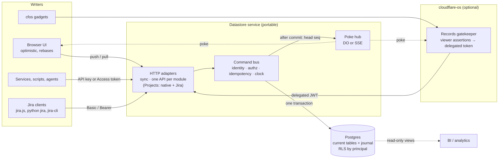
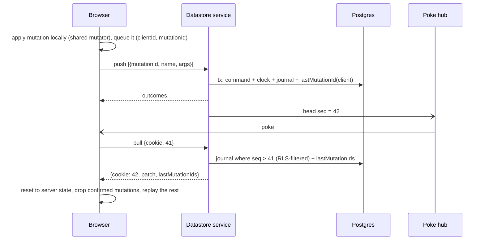

# Canonical Postgres datastore

> **Records direction superseded — 2026-09-25.** The current recommendation and delivery plan is [Records: shared application data](records-direction.md). This document is retained as historical research, implementation evidence or a separate gadget-HTTP proposal; it is not the specification for the new Records service. Existing deployment records remain historical facts, not instructions to deploy the new design.

> **Framing superseded (2026-09-25)** by [App datastore service: reframing](app-datastore-service.md). Records is a
> generic, schema-driven datastore for apps built on cloudflare-os. It was never meant to be a
> Jira-like product or a Projects service: project management with a Jira mapping is one example
> module. The mechanisms here (journal, per-datastore clock, identity and delegated tokens, RLS, sync) remain valid design input. The Projects-first and Jira-first scope, and the assumption that Neon hosts production, do not.

Written 2026-09-24 against starter `main` `5f8c12c`. Status (2026-09-25): **phases 1–5 built and tested
locally, phase 6 built as code and a [runbook](records-operations.md); remote phase 0 measurements
open.** See §10 for what each item left open. This is the
target shape for organisation datastores. It builds on the deployed
[organisation datastores](organisation-datastores.md) service (Records) rather than replacing it:
most of Records is already this design, and the phases below close the gaps. Evidence and confidence
levels are in [the research record](../../research/external_datastores/canonical-postgres-datastore-research.md).

## 1. Requirements

1. **Postgres is the source of truth.** Every read of record is strongly consistent. Nothing is
   authoritative anywhere else: not a Durable Object, not a gadget, not a browser.
2. **An API is the only way in.** No other system writes tables directly. Each kind of datastore
   has its own data model and its own REST API shaped to that model (§2, "Modules"). A module may
   also model its API on a well-known product in its domain, so existing clients work against it.
   Projects is the first module, and its API follows Jira.
3. **Writable from anywhere:** cloudflare-os gadgets, browsers outside cloudflare-os, backend services,
   scripts, agents and Jira tooling.
4. **A snappy UI.** Local changes apply at once and may be overwritten by what Postgres decides.
5. **Immutable history built in from the start,** without making ordinary reads expensive.
6. **Loosely coupled to cloudflare-os.** The service can run on Cloudflare or next to any Postgres, and
   still accept cloudflare-os identities and enforce them with row-level security.

Out of scope: an eventually consistent lake as the source of truth
([considered and not pursued](immutable-datastores.md)), gadget-owned data mirrored into Postgres
([considered](../../research/external_datastores/gadget-postgres-mirror.md)), logical-replication sync
engines, offline-first merging.

## 2. Shape



Four parts, each replaceable on its own:

| Part | Responsibility | Default deployment |
| --- | --- | --- |
| Postgres | Current state, immutable journal, registry, grants, RLS | Neon (London), as today |
| Datastore service | Every read and write; identity; command execution; adapters | Cloudflare Worker with Hyperdrive and a placement hint for `aws:eu-west-2`. The same code runs on Node beside any Postgres |
| Poke hub | Tells subscribers "datastore D is now at seq N". Carries no data | Durable Object per datastore (hibernating WebSockets); SSE plus pub/sub off Cloudflare |
| cloudflare-os adapter | Gatekeeper vendor, connect flow, gadget sessions, management UI hosting, viewer assertions, delegated tokens | `gatekeeper-records`, as today |

### Modules: one data model and one API per kind of datastore

A datastore is an instance of a **module**, such as Projects, Finance or a Message board. The service
is shared by every module; the data model and the API are not.

| Shared by every module (the core) | Owned by each module |
| --- | --- |
| Registry, memberships, roles, credentials, approvals | Its tables and migrations |
| Journal, per-datastore clock, `/changes`, `/history` | Its commands and business rules (handlers) |
| Identity, delegated tokens, RLS helpers (`records.can`) | Its permissions (`issues.read`, `invoices.approve`, …) |
| Command bus, idempotency, sync push/pull, poke hub | Its REST API, shaped to its data model |
| Problem codes, `Idempotency-Key`, `If-Match`, OpenAPI generation | Optionally, an API modelled on a familiar product |

So every datastore gets a REST API, but each module's API is tailored to its own data. Where a
well-known product already defines the shape people and tools expect, the module follows it:

| Module | Data model | API modelled on | Status |
| --- | --- | --- | --- |
| Projects | Projects, issues, workflow states, comments | Jira (§7) | Deployed as Records; Jira subset proposed here |
| Finance (example) | Accounts, contacts, invoices, payments, journals | Xero | Not planned yet |
| Message board (example) | Channels, threads, messages, reactions | Slack | Not planned yet |

Finance and Message board are illustrations of the pattern, not commitments. Each new module is its
own plan: data model, commands, permissions, API and, if it helps adoption, a compatibility target.
Everything else in this document applies to every module unchanged.

## 3. Data model: current state plus an immutable journal

### What "immutable" means here

Every change is recorded as an **immutable journal entry** in the same transaction as the update to a
narrow **current-state row**. The journal is the history, the audit trail, the sync feed and the
restore source. Current tables are a cache of the journal that is kept in step transactionally. A
test rebuilds them from the journal and compares.

This keeps reads as cheap as ordinary tables (no as-of predicate, no version joins) while giving full
history, "who changed what", per-datastore restore and a commit-ordered change feed. Full version
tables (SCD2 with PostgreSQL 18 `WITHOUT OVERLAPS`) are a later option for entities that need as-of
queries in SQL. They are not needed to get the benefits above.

No immutable structures are needed in Durable Objects. Durable Objects hold no truth in this design.
On the client, the pending-mutation queue replayed over server state is the immutable pattern that
matters.

### The per-datastore clock

```sql
CREATE TABLE records.datastore_clock (
  datastore_id uuid PRIMARY KEY REFERENCES records.datastores(id),
  seq          bigint NOT NULL DEFAULT 0
);
```

Each write transaction reads and validates first, then takes the clock as its **last** step:
`UPDATE records.datastore_clock SET seq = seq + 1 WHERE datastore_id = $1 RETURNING seq`. The row lock
serialises commits within one datastore, so `seq` is gapless and in commit order: a client that has
seen `seq = 41` has seen everything up to 41. Writes to different datastores do not contend. Taking the
lock last keeps it held only for the final inserts and the commit. The deployed outbox could not use
cursors because sequences are not commit order; this fixes that at the source.

Throughput per datastore is bounded by commit latency. That is ample for organisational records and
is measured in phase 0. A datastore that outgrows it splits by a module-declared key (a project) into
several clocks. Hyperdrive has no advisory locks, which is why this is a row, not a lock function.

### The journal

```sql
CREATE TABLE records.journal (
  org_id        uuid        NOT NULL,
  datastore_id  uuid        NOT NULL,
  seq           bigint      NOT NULL,       -- from the clock; one per transaction
  ordinal       smallint    NOT NULL,       -- position within the transaction
  change_id     uuid        NOT NULL,       -- uuidv7
  command       text        NOT NULL,       -- 'projects.transitionIssue'
  command_id    uuid        NOT NULL,       -- idempotency record
  entity_type   text        NOT NULL,
  entity_id     uuid        NOT NULL,
  entity_rev    int         NOT NULL,       -- revision after this change
  op            text        NOT NULL CHECK (op IN ('create', 'update', 'archive', 'restore', 'redact')),
  after         jsonb       NOT NULL,       -- new values of the changed fields
  before        jsonb,                      -- previous values of the changed fields
  actor_id      uuid        NOT NULL,       -- principal the change is attributed to
  act_id        uuid,                       -- delegating party (gateway, binding, service), if any
  via           text        NOT NULL,       -- 'gadget' | 'http' | 'sync' | 'jira' | 'system'
  occurred_at   timestamptz NOT NULL DEFAULT now(),
  PRIMARY KEY (datastore_id, seq, ordinal, occurred_at)
) PARTITION BY RANGE (occurred_at);
```

- Monthly partitions, B-tree on `(datastore_id, seq)`, BRIN on `occurred_at`. (Partitioned-table
  primary keys must include the partition key, hence `occurred_at` in it.)
- Application roles get `INSERT` and `SELECT` only. A trigger rejects `UPDATE` and `DELETE` for every
  role except the owner, and the owner uses that only through the audited redaction procedure (§8).
- **Every current-row write has its journal row.** Each module table carries `last_seq`. A deferred
  constraint trigger checks at commit that a journal row exists for `(datastore_id, last_seq,
  entity_id)`, so no code path, including future ones, can change current state silently.
- Personal data stays out: principals are referenced by ID, and their names and emails live in the
  registry.
- The existing `records.audit_events` stays for registry and management operations (grants,
  credentials, lifecycle). The journal covers record changes. The outbox stays for outbound delivery
  (webhooks), no longer for realtime.

### Deletes

Records are archived, not deleted (`op = 'archive'`, `archived_at` on the current row). Purging a whole
datastore is an administrative workflow that drops its rows and journal entries and is recorded in
`audit_events`.

## 4. The command bus

Every adapter turns its input into a command and calls one function:

```ts
execute(identity: VerifiedIdentity, datastoreId: string, command: Command, opts: {
  idempotencyKey: string; expectedRevision?: number;
}): Promise<CommandOutcome>
```

One transaction, in this order:

1. Set the trusted context: `SET LOCAL ROLE records_member`, principal, organisation, datastore and
   token scopes via `set_config(…, true)`.
2. Idempotency: the same key with the same request digest returns the saved outcome; a different
   digest is `idempotency_conflict`. This already exists (`domain/idempotency.ts`).
3. Authorise: principal rights ∩ token or binding scopes ∩ the command's permission. This already
   exists (`domain/authorize.ts`, `effectivePermissions`).
4. Run the module handler: read current rows (`FOR UPDATE` on the entities it changes), check
   `expectedRevision`, apply business rules, and produce new row values plus journal entries.
5. Take the clock (always the last lock taken, so lock order is the same in every transaction and
   cannot deadlock), write current rows with `last_seq`, insert journal rows and any outbox rows, and save
   the outcome.
6. Commit. Then tell the hub the new head `seq`. This is best effort, because clients also pull.

Outcomes keep the existing vocabulary: `applied` (with `seq` and revisions), `pending` (queued for
approval in cloudflare-os), `rejected`, and `conflict`. Errors keep the existing problem codes:
`revision_conflict` is 412, `revision_required` is 428, and workflow, duplicate and idempotency
conflicts are 409.

Handlers are written as **pure mutators** over a small read/write interface, so the same code runs in
the browser for optimistic updates and on the server for real (§6). The server's result always wins.

## 5. Identity and row-level security

### Who can call

The service trusts a configured list of issuers and credential types, stored in Postgres:

| Caller | Credential | Becomes |
| --- | --- | --- |
| A person in a cfos gadget | A **delegated token** minted by the cfos Records gatekeeper after it redeems the viewer assertion: JWT, 60 s, `sub` = the viewer's principal, `act` = the binding, `scope` = the binding's scopes, `aud` = the datastore service | That person, limited to the binding's scopes |
| A person in a browser UI outside cfos | An OIDC token from **Cloudflare Access for SaaS** (the platform's Access acting as identity provider) | That person |
| A person or script behind the platform's Access | `Cf-Access-Jwt-Assertion` for a path-specific Access application | That person, or the service token's mapped service principal |
| A backend service or script | An `rk1_…` datastore credential (existing format, SHA-256 digest, expiry), optionally with an Access service token in front | A service principal with explicit scopes |
| A Jira client | HTTP Basic `email:<rk1 token>` or `Bearer <rk1 token>` | The same service principal |

Each resolves to one **principal** through `records.identity_mappings (issuer, subject)`, which already
exists. The delegated token replaces today's in-process trusted `CallerContext` between the gatekeeper
and the domain code, so the datastore service no longer needs to live in the same Worker as the
gatekeeper. Its JWKS is published at `/gatekeeper/records/.well-known/jwks.json`. Viewer assertions
(fork `a687cbdf`) remain the proof that a particular viewer asked for a particular write. They are
redeemed in cloudflare-os, and the datastore sees only the resulting short-lived token.

### Row-level security by principal

Today, RLS scopes rows to the organisation and datastore the trusted service chose. The service is
responsible for membership. The canonical design moves membership into the database as a second line:

```sql
-- Sketch. role_permissions() would mirror ROLE_PERMISSIONS in records-contracts.
CREATE FUNCTION records.can(ds uuid, perm text) RETURNS boolean
  LANGUAGE sql STABLE SECURITY DEFINER SET search_path = records AS $$
  SELECT EXISTS (
    SELECT 1 FROM records.memberships m
     WHERE m.datastore_id = ds
       AND m.principal_id = current_setting('records.principal_id')::uuid
       AND perm = ANY (records.role_permissions(m.role))
       AND perm = ANY (string_to_array(current_setting('records.scopes'), ',')))
$$;

CREATE POLICY member_read ON projects.issues FOR SELECT TO records_member
  USING (datastore_id = (SELECT records.current_datastore())
         AND (SELECT records.can(records.current_datastore(), 'issues.read')));
```

- The `(SELECT …)` wrapping makes Postgres evaluate the check once per statement, not once per row.
- Writes use the same pattern with `WITH CHECK` and the write permission.
- An application bug that skips an authorisation check, or sets another datastore, still cannot read
  or write rows the principal has no grant for.
- The same policies serve a **read-only analytics role** with per-principal logins, if direct SQL for
  BI is ever wanted, through a versioned `analytics` schema of views.

Settings are transaction-local, which already works through Hyperdrive in local tests. It still needs
proving through the deployed Hyperdrive (an open Phase 0 item in the Records plan).

## 6. Snappy UI: optimistic mutations with server rebase

The sync endpoints implement the semantics of the Replicache protocol against our own backend. We do
not depend on the library, which is in maintenance mode. Zero is ruled out because it needs logical
replication and a `zero-cache` server.



- **Push.** Mutations apply in client order. `(clientId, mutationId)` is the idempotency key. A
  mutation that fails for good is still marked processed and returns `rejected`. The client drops it
  and shows why, rather than stalling.
- **Pull.** `cookie` is the datastore `seq`. The patch is built from journal rows after the cookie, or
  from current tables when the cookie is older than journal retention. It is filtered by RLS like any
  read.
- **Rebase.** The client keeps server state and pending mutations separately. On every pull it resets
  to server state and replays still-pending mutations with the shared mutators. A server decision
  therefore always overwrites a local guess, and edits the server has not seen yet are not lost.
- **Approvals in cloudflare-os.** A gadget mutation that needs approval returns `pending`. It counts as
  processed, and the UI keeps showing it as pending, as `writes.js` in the project board does today.
  If approved, the resulting change arrives through an ordinary pull. Bindings can pre-approve routine
  commands so that most edits apply immediately.
- **Persistence.** Pending mutations stay in memory. A page with unsynced changes says so, in line with
  the Records rule against silently persisting offline business writes.
- **Other subscribers.** Gadget hooks and SDK subscribers use the same poke and pull, keyed by `seq`,
  replacing identifier notifications and full resyncs.

## 7. APIs

Every module has a native API. A module may add a compatibility API modelled on a familiar product.
Both are thin adapters over the same commands. The native routes and the Jira subset below belong to
the Projects module; a Finance or Message board module would define its own.

### Native API (`/v1`, existing)

`/gatekeeper/records/v1/datastores/:id/…` stays: typed commands with `Idempotency-Key` and `If-Match`,
problem+json, bounded bodies, a 15 s deadline, rate limits. Added:

| Route | Purpose |
| --- | --- |
| `POST …/sync/push`, `POST …/sync/pull` | Section 6 |
| `GET …/changes?after=<seq>&limit=` | Journal read for integrations; the commit-ordered cursor makes this safe |
| `GET …/issues/:id/history` | An entity's journal entries |
| `GET /v1/openapi.json` | Generated from the Zod contracts with `@hono/zod-openapi` (the repo already uses Zod 4) |

SDKs are generated from that document: TypeScript first, then Python. They send idempotency keys
automatically, retry only idempotent calls, honour `Retry-After`, and surface 412 conflicts with the
current revision.

### Projects module: Jira-compatible subset

Served per datastore at `…/datastores/:id/jira/rest/api/{2,3}/…`, so a client points its base URL at
that path. There is no maintained open-source Jira-compatible server to copy, so compatibility is
defined by the clients: jira.js, Python `jira`, go-jira and jira-cli run against the service in CI.

| Jira surface | Maps to |
| --- | --- |
| `GET /serverInfo`, `/myself`, `/user/search`, `/user?accountId=` | Deployment info; the caller's principal; members of the datastore (`accountId` = principal ID) |
| `GET /project/search`, `/project/{key}` | `projects` |
| `GET /field`, `/priority`, `/status`, `/issuetype` | System fields; `customfield_<n>` per custom field definition; the five priorities; workflow states; one issue type, `Task` |
| `POST /issue`, `GET /issue/{key}`, `PUT /issue/{key}` | `createIssue`, `getIssue`, `editIssue` |
| `GET/POST /issue/{key}/transitions` | Workflow transitions. A transition's ID is the target state's ID (Jira "global transition" style), and the list comes from `workflow_transitions` |
| `GET/POST /issue/{key}/comment` | `listComments`, `addComment` |
| `GET/POST /search/jql` with `nextPageToken`; `/search` returns 410 as Jira does | JQL subset → typed list query |
| Webhooks | Jira-shaped payloads (`jira:issue_created`, `jira:issue_updated` with `changelog` built from the journal, `comment_created`) signed with `X-Hub-Signature`, delivered from the outbox |

Mapping details:

- **Identifiers.** Jira clients expect numeric-string `id`s beside keys. Issues, projects, comments and
  statuses get a `jira_id bigint` from a sequence. Issue keys (`ENG-12`) already match Jira's format.
- **Priority.** `urgent` → Highest, `high` → High, `medium` → Medium, `low` → Low. `none` is an absent
  priority field.
- **Status category.** `todo` → `new`, `in_progress` → `indeterminate`, `done` → `done`.
- **Rich text.** v2 takes and returns plain text. v3 takes and returns ADF, converted to and from
  Markdown. The supported subset is paragraphs, headings, lists, code, links, emphasis and mentions;
  other nodes are rejected with 400 rather than silently dropped.
- **JQL subset.** `project`, `key`, `status`, `statusCategory`, `assignee` (including `currentUser()`
  and `EMPTY`), `priority`, `created` and `updated` comparisons, `text ~`, `AND`, `OR`, `NOT`,
  parentheses, `ORDER BY created|updated|priority|key`. Anything else returns Jira's 400 error shape.
  The grammar is `@atlaskit/jql-parser` if its size is acceptable in the Worker, or a small hand-written
  parser.
- **Not in scope:** the Agile API (`/rest/agile/1.0`: boards, sprints), attachments, worklogs, issue
  links, the permissions API, most `expand` options. Each is a separate decision driven by a client
  that needs it.
- Jira-surface writes are ordinary commands, with `via = 'jira'`, the same authorisation, and journal
  entries.

## 8. Operations

- **Backups.** Neon's current 6-hour history is not enough. Move to a paid plan with a longer
  history window, and add a nightly `pg_dump` to R2 with a 30-day lifecycle rule and a bucket lock.
  Rehearse a restore.
- **Restoring one datastore.** Restore a Neon branch to the chosen time, read that datastore's journal
  up to the chosen `seq`, and replay it as `system` commands into production. Other datastores are not
  rewound, which answers the Records plan's open question about independent restore.
- **Erasure.** The journal holds principal IDs, not personal details, so erasing a person means
  removing their registry details. Free text that must go is removed by a redaction command. It
  overwrites the named fields in the current row and in past journal entries with a marker, as the
  migration owner, and records a `redact` journal entry and an audit event. This is the one sanctioned
  exception to immutability.
- **Retention.** Journal partitions older than the retention window move to cold storage (Parquet on R2
  is fine for this) and are detached. Pulls with older cookies get a full reset.
- **Analytics.** Read-only views in an `analytics` schema, treated as a versioned contract, on a Neon
  read replica. The journal gives incremental extraction by `seq`, if a warehouse is ever wanted.

## 9. From Records today to this

| Area | Records now | Change |
| --- | --- | --- |
| Contracts | Zod DTOs, permissions, errors | Add command, journal, sync and Jira DTOs; generate OpenAPI |
| Schema | Current tables with `revision`; `audit_events`; outbox | Migration 0003: `datastore_clock`, partitioned `journal`, `last_seq` columns, the journal-presence trigger, `client_mutations`, `trusted_issuers`, principal RLS (`records.can`), `jira_id` columns. Additive; the deployed database has no business data yet |
| Domain | `projects.ts` and `registry.ts` write SQL inline in `withContext` | Extract `@records/core` with no Cloudflare imports: command bus, handlers as mutators, repositories behind a small port |
| Transport | `/v1` routes; gadget session in the same Worker | `/v1` plus sync, changes, history and Jira; Hono with generated OpenAPI; the gadget path calls the service with delegated tokens |
| Realtime | Outbox → Queue → `DatastoreFeed` → identifier hooks → refetch | Post-commit poke through the hub; gadget hooks and SDKs pull by `seq`. The Queue remains for webhooks only |
| Runtime | One Cloudflare Worker | The same Worker by default, with a placement hint near Neon; a Node entry point proves portability |
| Clients | Board polls outcomes and refetches | Board uses the sync client with optimistic mutators; the report pulls by `seq` |

Nothing in the deployed Records design is abandoned. Its decisions on publication versus
provisioning, the registry, observer rules, approvals and credentials carry over unchanged.

## 10. Phases

`[x]` done with tests, `[~]` partly done (the note says what is missing), `[ ]` not started. Each phase ends with tests and a short evidence note in the research record.

### Phase 0: spikes

- [~] *Local only (embedded PG 17, `records-core/bench`): 119 cmd/s with one writer, ~300 with four, gapless over 6,089 entries; a single hot project's issue numbering, not the clock, starves first. Through Hyperdrive with and without placement: not measured.* **Clock.** Commit latency and writes per second on one datastore with the clock taken last,
      through Hyperdrive from a Worker with and without `placement.region = "aws:eu-west-2"`. Kill gate:
      if single-datastore throughput is below 50 commands per second, design clock splitting before
      phase 1.
- [~] *`records.can_any` costs ~0.05 ms per statement locally; 100k-issue scale and deployed Hyperdrive not measured.* **RLS by principal.** Policy cost for list and search queries at 100k issues and 1,000 members,
      with the `(SELECT …)` pattern. Confirm transaction-local settings through deployed Hyperdrive.
- [x] **Delegated token.** Gatekeeper mints it, the service verifies it, and a replayed, expired,
      re-scoped or wrong-audience token is refused.
- [~] *jira.js 6.2.0 and Python `jira` 3.10.5 pass against the real service (`packages/records-jira/COMPATIBILITY.md`); jira-cli and go-jira need network installs and are untested.* **Jira clients.** A stub serving `serverInfo`, `myself`, `field`, `project/search`, `issue` and
      `search/jql`, driven by jira.js, Python `jira` and jira-cli. Record what each client calls and
      assumes.
- [x] **Sync loop.** Push, pull and rebase with two browsers and a pending approval, under dropped pokes
      and reordered responses.

### Phase 1: journal and clock

- [x] Migration 0003 (clock, journal, `last_seq`, trigger, partitions and their maintenance job).
- [x] Command bus in `@records/core`; Projects handlers write journal entries.
- [x] Rebuild-and-compare test; late-commit and concurrency tests on the clock.

### Phase 2: identity

- [x] `trusted_issuers`, JWT verification (Access, Access for SaaS, delegated), `rk1_` and Basic.
- [x] Principal RLS on every module table; negative tests with a service that skips its own checks.
- [x] Gatekeeper switches to delegated tokens.

### Phase 3: sync and realtime

- [x] Push, pull, `client_mutations`, poke hub, `/changes`, `/history`.
- [x] Browser sync client and shared mutators; the project board adopts it; gadget hooks pull by `seq`.
- [~] *Pokes replace it for the board and report; the identifier feed still runs for older hooks, and the Queue now drives webhooks.* Retire the Queue path for realtime.

### Phase 4: portability and SDKs

- [x] *Without Hono: OpenAPI 3.1 from the Zod contracts with `z.toJSONSchema` (`gatekeeper-records/src/http/openapi.ts`); `packages/records-node` runs the same contract suite as real workerd against one database.* Hono app with generated OpenAPI; a Node runtime entry point running the same contract suite
      against the same database.
- [x] TypeScript and Python SDKs from the OpenAPI document.

### Phase 5: Jira surface

- [x] The subset in §7, with ADF conversion and the JQL subset.
- [~] *jira.js and Python `jira` suites run in the package tests; webhooks (native and Jira-shaped) deliver from the outbox via the Queue and cron.* The client compatibility suite in CI; Jira-shaped webhooks from the outbox.

### Phase 6: operations

- [~] *Scripts and replay-restore built and tested locally; no bucket, schedule or rehearsal on real data yet.* Backups to R2, restore rehearsal, per-datastore restore by journal replay.
- [x] *Retention archival is code only; no window chosen.* Redaction procedure; journal retention and archival; analytics views on a read replica.
- [ ] Operator workflow before any production change, per `CLAUDE.md`.

## 11. Acceptance scenarios

1. The same change made through a gadget, the native API, the sync endpoint and a Jira client produces
   the same current row and equivalent journal entries, attributed correctly (`actor`, `act`, `via`).
2. A client that pulls from any `seq` converges to the current state, with no missed changes under
   concurrent writers.
3. Two browsers editing the same issue both see their edits instantly. The loser of a conflict sees
   the server's version replace their guess, with a visible explanation.
4. A current-row write without a matching journal entry fails at commit, whichever code path makes it.
5. A service with a deliberately broken authorisation check still cannot read or write another
   principal's datastore, because RLS refuses it.
6. jira.js, Python `jira` and jira-cli can list projects, create, edit, transition, comment and search
   within the documented subset.
7. One datastore restored to yesterday through journal replay leaves every other datastore untouched.
8. The service passes its contract suite on Workers and on Node against the same database.

## 12. Decisions for the owner

| Decision | Recommendation |
| --- | --- |
| Journal only, or full version tables too | Journal plus current tables now; add version tables per entity only when a feature needs as-of SQL |
| Ordering | Per-datastore clock row; split by project only if phase 0 shows contention |
| Sync library | Our own implementation of Replicache-style semantics; neither Replicache nor Zero as a dependency |
| Where the service runs | The existing Worker, placed near Neon; portability proven by a Node entry point, not by a second deployment |
| Jira surface first cut (Projects only) | v2 plain text and v3 with ADF, issues, transitions, comments, projects, `search/jql`; no Agile API |
| Identity for UIs outside cfos | Cloudflare Access for SaaS as the OIDC provider |
| Postgres version | Stay on 17 until a feature needs 18 (temporal keys, `uuidv7()`, `RETURNING OLD`) |
