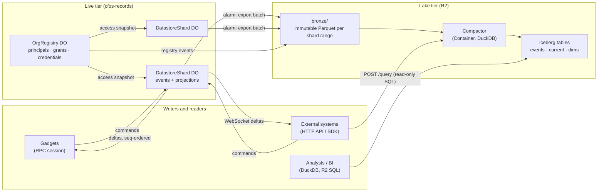
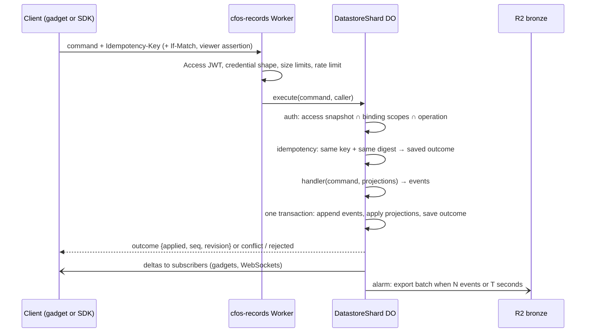

# Immutable datastores: event-sourced shards and an R2 lake

> **Records direction superseded — 2026-09-25.** The current recommendation and delivery plan is [Records: shared application data](records-direction.md). This document is retained as historical research, implementation evidence or a separate gadget-HTTP proposal; it is not the specification for the new Records service. Existing deployment records remain historical facts, not instructions to deploy the new design.

Written 2026-09-24 against starter `main` `5f8c12c`. Status: **not pursued (2026-09-24).** The owner's
verdict: an eventually consistent lake does not solve the actual problem, which is a strongly consistent
source of truth; analytics can be fed from Postgres. The direction is the
[canonical Postgres datastore](canonical-postgres-datastore.md). Parts worth keeping from this document are
listed there: commit-ordered per-datastore sequences, the hash-chained journal envelope, and command-only
writes. It was written as an alternative to the Postgres-backed [organisation datastores plan](organisation-datastores.md), which
is deployed against Neon with the machine API switched off. Evidence, sources and confidence levels
are in [the research record](../../research/external_datastores/immutable-datastores-lakehouse.md).

## 1. Outcome

Every organisation datastore is an **append-only event log** held by one or more Durable Object
shards. The shard is the live, strongly consistent copy: it validates commands, appends events,
maintains current-state projections, and pushes changes to gadgets and external subscribers. Every
event is exported to **R2** as immutable Parquet, from which a lakehouse (Iceberg on R2 Data Catalog,
queried with DuckDB or R2 SQL) serves analytics, history, cross-datastore questions and backup.

Each datastore has a versioned HTTP API and a generated SDK, and external systems can write to it
with scoped credentials. Gadgets keep their existing typed RPC, now served by the shard.

Postgres, Hyperdrive, the outbox publisher and its Queue go away. The contracts, permission algebra,
transports, viewer assertions, connect flow and management UI stay.



## 2. Principles

1. **Events are the only writes.** A command is validated against current projections; if accepted,
   the shard appends one or more events and applies them to the projections in the same SQLite
   transaction. Events are never updated or deleted in place. Corrections are new events.
2. **Projections are disposable.** Current-state tables in the shard and in the lake are derived and
   can be rebuilt from events. A new projection version is a rebuild, not a migration.
3. **One writer per shard, one sequence per shard.** `seq` is allocated inside the write transaction,
   so it is commit order. Every consumer (gadget, SDK subscriber, exporter) resumes from a `seq`.
4. **Bronze is the archive.** Exported Parquet in R2 is byte-for-byte reproducible from a shard range
   and named deterministically. Iceberg (or DuckLake) tables are built from bronze and can be rebuilt
   from it, so the catalog choice is reversible.
5. **Clients send commands, not events.** The external API exposes domain operations with the same
   authorisation, idempotency and revision rules as gadgets. No client authors raw events.
6. **Freshness is explicit.** The live tier gives read-your-writes. The change feed follows within
   seconds. The lake is minutes behind. APIs say which tier they read.

## 3. Resources

| Resource | Holds | Keyed by |
| --- | --- | --- |
| `Directory` DO (one per deployment) | Global lookups only: identity (issuer, subject) → org; credential key ID → org and datastore | singleton |
| `OrgRegistry` DO (one per organisation) | Principals, identity mappings, org roles, datastore index, memberships, bindings, credential digests, discovery policy. Itself event-sourced | org ID |
| `DatastoreShard` DO | One datastore's event log, projections, idempotency records, access snapshot, subscribers, export watermark | `(datastore ID, shard key)` |
| `ConnectFlow`, `RecordsGatekeeper` (existing) | Unchanged roles | as today |
| R2 bucket `cfos-lake` | `bronze/`, Iceberg warehouse, compactor state | per organisation prefix |
| Compactor Container | DuckDB process that builds silver and gold tables and serves authorised SQL | on demand |

### Sharding

Default: **one shard per datastore** (shard key `_`). A Durable Object comfortably handles the
expected write rate and 10 GB bounds a single shard's local state, not the datastore's history,
because exported events are trimmed locally (§6).

A module may declare a shard key (Projects: `projectId`) for datastores that outgrow one object.
Then:

- Commands carry the shard key, and the router Worker sends them to that shard.
- A datastore-level `index` shard holds cross-shard lists (projects, workflow definition) and is the
  only place for datastore-wide invariants.
- There are no cross-shard transactions. A cross-shard change is a saga of commands with idempotency
  keys, visible as separate events.
- Cross-shard queries read the lake, or the index shard for the lists it maintains.

Splitting a live shard is an explicit operation (freeze, copy events with provenance, cut over), not
automatic rebalancing.

### Gadget-hosted shards

A gadget's own facet can also be a shard, for data the gadget owns (kanban, whiteboard). It writes the
same event envelope into its facet SQLite through its `Repository` seam, and a `LAKE` connector exports
its batches into `bronze/` under `source=gadget/gadget=<id>`. The gadget stays authoritative, is not
externally writable through this API (see the separate [gadget HTTP API](gadget-http-api.md)), and its
data disappears from the live tier when the gadget is deleted. The lake keeps it.

| | Datastore shard | Gadget-hosted shard |
| --- | --- | --- |
| Owner | Organisation, via registry | The gadget |
| Survives gadget deletion | Yes | Lake copy only |
| External writes | HTTP API and SDK | No |
| Authorisation | Registry grants, viewer assertions | Workshop sharing |
| Lake partition | `source=datastore` | `source=gadget` |

This is how gadget Durable Objects become shards of the lake. In the lake they are also a dimension:
`dim_gadget` (blueprint, revision, workspace, owner) joins to their events.

## 4. Event model

### Envelope (`records-contracts/src/ledger.ts`, v2)

```ts
type LedgerEvent = {
  v: 2;
  eventId: string;          // UUIDv7, globally unique
  orgId: string;
  datastoreId: string;      // or gadget ID for gadget-hosted shards
  shard: string;            // shard key, "_" by default
  seq: number;              // per shard, contiguous, commit order
  type: string;             // "projects.issue.created"
  typeVersion: number;      // payload schema version for this type
  entityType: string;
  entityId: string;
  entityRev: number;        // revision of the entity after this event
  actor: {                  // trusted, set by the shard, never by the payload
    principalId: string;
    via: "gadget" | "http" | "agent" | "system";
    bindingId?: string;
    initiatorPrincipalId?: string;
  };
  commandId: string;        // idempotency record; several events may share it
  occurredAt: string;       // shard clock at commit
  payload: unknown;         // validated per (type, typeVersion); protected fields encrypted (§8)
  prevHash: string;         // SHA-256 of the previous event's canonical form
  hash: string;             // SHA-256(prevHash || canonicalJson(event without hash))
};
```

The hash chain makes the local log and bronze files tamper-evident at negligible cost: an auditor can
verify a shard's history from bronze alone. `ChangeNotification` (identifiers and revisions) remains
the payload-free form for audiences that must not see content.

### Modules

A module supplies, in TypeScript:

- command schemas and handlers: `(command, projections, caller) → events | RecordsError`;
- event schemas per `(type, typeVersion)` plus upcasters from older versions;
- projection definitions: SQLite DDL and an `apply(event)` function; a projection version number;
- lake mappings: which events feed which silver and gold tables, as DuckDB SQL run by the compactor;
- the route manifest for HTTP and SDK generation.

Porting Projects means rewriting `domain/projects.ts` as command handlers over SQLite projections.
Validation, workflow and permission rules move unchanged; `ILIKE`, `jsonb` and row locks become
`LIKE` with `lower()`, JSON text and the single-writer guarantee.

### Declared collections (second module)

Because a schema change is a projection rebuild rather than a migration, a generic module becomes
cheap: a datastore declares entity types with JSON Schema, field types and indexes, and gets typed
commands (`create`, `update` with revision, `archive`), projections, lake tables, OpenAPI and an SDK
generated from that declaration. This is the route to a blueprint ticking "backed by a datastore"
without a hand-written module. It comes after Projects is proven.

## 5. Write path



- **Gadget writes** keep the current approval path: the session queues the action, `applyAction`
  calls the shard with the redeemed viewer assertion, and apply-time re-authorisation happens inside
  the shard's transaction. `pending`, `applied`, `rejected` and `conflict` outcomes are unchanged.
- **External writes** are authorised by credential and applied immediately (§7).
- **Deadlines.** A 504 means "outcome unknown"; the client retries with the same idempotency key and
  receives the saved outcome. Overloaded shards return 503 with `Retry-After`, never retried
  internally.

## 6. Export and the lake

### Bronze (authoritative archive)

A shard alarm exports when 1,000 events or 30 seconds have accumulated since the watermark (both
configurable, to be set from measurements). It writes Parquet with hyparquet-writer:

```text
bronze/org=<org>/source=datastore/ds=<id>/shard=<key>/seq=<from:012>-<to:012>.parquet
```

- Batches are cut on fixed boundaries recorded before the upload, so a retry rewrites the same
  range with the same bytes.
- The watermark advances only after the PUT succeeds; then the shard records the object's ETag.
- Local events older than the export watermark and the latest projection snapshot are trimmed after
  a retention window (default 30 days), keeping the shard well under 10 GB. Rebuilding a shard
  replays its bronze files, then any unexported local tail.
- The registry exports its own events the same way under `source=registry`.

### Silver and gold (Iceberg on R2 Data Catalog)

A scheduled compactor (Worker cron → Container running DuckDB 1.5.x) runs every 5 minutes by default:

1. List bronze objects newer than its checkpoint (stored in R2).
2. `INSERT` into `silver.events` (partitioned by org, datastore, day), deduplicated on
   `(datastore, shard, seq)` and checked for contiguity and hash-chain continuity.
3. `MERGE` into gold current-state tables per module (`projects.issues_current`, …) using `entityRev`.
4. Maintain slowly-changing dimension tables from registry events: `dim_principal`, `dim_datastore`,
   `dim_membership`, `dim_gadget`, each with `valid_from`/`valid_to`.
5. Advance the checkpoint.

R2 Data Catalog performs compaction and snapshot expiry. Orphan cleanup is ours: a weekly sweeper
removes unreferenced data files older than the snapshot retention.

**Why not Pipelines?** It has no idempotency key, is append-only, sits at 60 s or more latency, and
has a public report of a permanently corrupted table. Bronze through our own exporter keeps a
reproducible archive whatever happens to a catalog.

**DuckLake instead of Iceberg** is an experiment (phase 0, spike L2), not the default: its catalog
needs Postgres for concurrent use, or a single-writer SQLite catalog owned by the compactor. It suits
many small writes better, and bronze makes it cheap to build both from the same input and compare.

### The duckhouse: reading the lake

| Reader | Path | Authorisation |
| --- | --- | --- |
| Analysts and BI | DuckDB, Spark, Trino or MotherDuck attaching the R2 Data Catalog | Read-only catalog token for an organisation's warehouse; data administrators only |
| Serverless ad-hoc | R2 SQL | Same token |
| API and SDK users | `POST /v2/datastores/:id/query` → compactor Container | The service builds views restricted to the caller's permitted datastores, disables external access and file functions, and runs read-only SQL with row, byte and time limits |
| Agents | The query endpoint through a gatekeeper session, as an observation | Binding scopes |

The lake has **no row-level security**. A catalog token reads everything in its warehouse. Therefore:
direct lake access is for organisation data administrators; per-datastore access goes through the
query service; confidential datastores go to a separate warehouse with its own token. This is the
biggest difference from Postgres RLS and must be accepted explicitly.

## 7. HTTP API and SDK

Base: `/gatekeeper/records/v2/datastores/:datastoreId`. Routes are generated from module route
manifests. Projects v2 keeps v1's shapes:

| Route | Tier |
| --- | --- |
| `GET /` (datastore metadata), `GET /projects`, `GET /issues`, `GET /issues/:id`, … | Live projections |
| `POST /issues`, `PATCH /issues/:id` (If-Match), `POST /issues/:id/transitions`, … | Command → events |
| `GET /events?after=<seq>&shard=<key>&limit=` | Live log, then bronze beyond local retention |
| `GET /subscribe?after=<seq>` (WebSocket, hibernating) | Live deltas; resumes from `seq`; closes on revocation |
| `POST /query` | Lake (minutes stale), read-only SQL |
| `GET /openapi.json` | Generated contract |

**Authentication** (both layers required, as in the v1 adapter and the HTTP API review):

1. A path-specific Access application with a Service Auth policy, its own audience, validated by the
   Worker (`common_name` present; no human identity inferred).
2. A datastore credential `rk2_<datastoreShort>_<keyId>_<secret>`. The datastore prefix lets the
   Worker route to the right organisation and shard without a global lookup; the shard compares
   SHA-256(secret) against its access snapshot in constant time. Credentials are scoped to one
   datastore and a set of operation scopes, expire by default (90 days), are shown once, and are
   minted only in the management UI.

Browser clients of the management UI keep the Workshop session. OAuth 2.1 via workers-oauth-provider
is a later option for third-party apps acting for users.

**SDK** (`packages/records-sdk`, TypeScript first; OpenAPI enables other languages):

```ts
const ds = records({ baseUrl, accessClient, token }).datastore(id);
const issue = await ds.issues.create({ projectId, title }, { idempotencyKey });  // key generated if omitted
await ds.issues.transition(issue.id, "in_progress", { ifRevision: issue.revision });
for await (const d of ds.subscribe({ after: savedSeq })) apply(d);                // resumable
const rows = await ds.query`select state, count(*) from issues_current group by 1`;
```

It retries only idempotent calls, honours `Retry-After`, never logs secrets, and exposes the tier of
every read.

## 8. Authorisation, identity and erasure

- **Access snapshot.** The registry is authoritative for grants. Each shard holds a versioned snapshot
  of what it needs: memberships and roles, principal status, active bindings and their scopes,
  credential digests. The registry pushes a new snapshot on every relevant change.
- **Revocation ordering.** `revoke*` in the registry commits, pushes the new snapshot to every
  affected shard, and returns only when each has acknowledged. A shard applies commands in order, so
  a command authorised after the acknowledgement is denied. A shard that cannot be reached leaves the
  revocation `pending`, and the registry retries; the management UI shows it. Subscriptions are
  closed on the new snapshot. This replaces the `FOR SHARE` ordering.
- **Viewer assertions and observers** work as today; `readersAmong` reads the shard's snapshot.
- **Global lookups.** Identity → org is the only query that needs the `Directory` DO; the connect
  flow and viewer-assertion checks cache it. Credentials carry their datastore, so HTTP requests never
  touch it.
- **Personal data.** Events store principal IDs, not names or emails; those live in registry
  projections. Fields a module marks `personal` are encrypted with a per-subject key held by the
  registry (key-encryption key from a Worker secret). Erasing a subject destroys the key and emits a
  `subject.erased` event.
- **Free text** (titles, descriptions, comments) can mention anyone, so crypto-shredding alone is not
  enough. Erasure of free text is a redaction command that emits a `redacted` event, rebuilds the
  affected projections, and runs a documented lake procedure: rewrite the affected bronze ranges with
  the redaction applied (new hash chain segment, provenance recorded), rewrite silver files, expire
  snapshots and sweep orphans. Durable Object point-in-time recovery keeps deleted local rows for
  about 30 days; the procedure must state that.
- **Purge of a whole datastore** destroys its data key (bronze files for confidential datastores are
  written with a per-datastore key) and removes its prefix.

## 9. What changes in the repository

| Path | Change |
| --- | --- |
| `packages/records-contracts` | Add `ledger.ts` (envelope, hash, canonical form), module interface, route manifest types. Drop `ModuleManifestSchema.schema` and `statementTimeoutMs` when Postgres is retired |
| `packages/gatekeeper-records/src/domain/service.ts` | Turn `RecordsService` into an interface; keep the Postgres implementation until cut-over |
| `packages/gatekeeper-records/src/ledger/` (new) | `DatastoreShard`, `OrgRegistry`, `Directory` DOs; command execution, projections, idempotency, access snapshots, export alarm |
| `packages/gatekeeper-records/src/modules/projects/` (new) | Command handlers, events, projections, lake SQL, route manifest |
| `packages/gatekeeper-records/src/http/` | v2 router generated from manifests; `/events`, `/subscribe`, `/query`, `/openapi.json` |
| `packages/gatekeeper-records/src/vendor/` | Session methods call shards; `onChange` hooks receive seq-ordered deltas; `DatastoreFeed` and the Queue consumer are retired |
| `packages/records-lake/` (new) | Compactor Container image (DuckDB), silver/gold SQL, orphan sweeper, query service |
| `packages/records-sdk/` (new) | Generated TypeScript client and CLI |
| `packages/records-schema` | Retired after cut-over, or kept only if DuckLake-on-Neon wins spike L2 |
| `scripts/deploy.ts`, `deployment-config.ts` | `records.backend: "postgres" \| "ledger"`; R2 bucket, catalog token secret, Container, new DO migrations; drop Hyperdrive and Queue when `ledger` |

The management UI, connect flow, configurator, viewer assertions (fork `a687cbdf`) and the
blueprint clients keep their interfaces.

## 10. Phases

Each phase leaves evidence. `[ ]` not started.

### Phase 0: spikes and kill gates

- [ ] **S1 shard.** A `DatastoreShard` with Projects `createIssue`/`transitionIssue`: append,
      project, idempotency and hash chain in one transaction. Measure p50/p99 command latency and
      sustained commands per second in local workerd and deployed.
- [ ] **S2 export.** hyparquet-writer inside the shard: bundle size, memory for 1,000-event batches,
      deterministic bytes on retry, alarm retry behaviour, trimming and rebuild from bronze.
- [ ] **S3 compactor.** Container with DuckDB 1.5.x attaching R2 Data Catalog: bronze → silver
      INSERT with dedupe, gold MERGE, run time and cost per run at 10k and 1M events, cold start.
- [ ] **L2 DuckLake.** Same bronze into DuckLake with (a) a SQLite catalog owned by the compactor and
      (b) the existing Neon database as catalog. Compare freshness, small-file behaviour, reader
      ergonomics and maintenance with Iceberg. Decide the default table format.
- [ ] **S4 query service.** Prove that DuckDB can be locked down (no file or network access after
      attach, configuration locked, resource limits) and that datastore-restricted views cannot be
      escaped. Kill gate: if it cannot, `/query` ships for data administrators only.
- [ ] **S5 revocation.** Registry → shard snapshot push with acknowledgement; unreachable shard;
      command racing a revoke; subscription closure.

Exit: measured numbers recorded in the research document; table format chosen; kill gates passed or
the plan revised.

### Phase 1: port and ledger core

- [ ] `RecordsService` interface; the behavioural suites (`domain`, `http`, workerd session) run
      against both backends.
- [ ] Ledger envelope, module interface, Projects module on the shard, OrgRegistry and Directory.
- [ ] Negative authorisation tests carried over: wrong organisation, wrong datastore, forged caller,
      reader writes, binding scope escape, replayed idempotency keys.

### Phase 2: transports

- [ ] Gadget session and hooks on shards, with deltas; project board and report unchanged apart from
      removing refetch-on-notify.
- [ ] HTTP v2, `rk2_` credentials, path-specific Access, `/events`, `/subscribe`, `/openapi.json`.
- [ ] SDK and CLI with contract tests generated from the same manifests.

### Phase 3: lake

- [ ] Export alarm, bronze layout, trimming, rebuild from bronze.
- [ ] Compactor, silver, gold, dimensions, orphan sweeper, catalog token handling.
- [ ] `/query` and SDK `query`, within S4's result.
- [ ] Gadget-hosted shards: `LAKE` connector and kanban `Repository` adapter.

### Phase 4: cut-over and operations

- [ ] Import existing Neon records as genesis events (`system` actor, provenance), verify counts and
      revisions, switch `records.backend` to `ledger`, keep Neon read-only for an agreed period, then
      decommission.
- [ ] Erasure and purge procedures rehearsed end to end, including bronze rewrite.
- [ ] Restore rehearsals: rebuild a shard from bronze; rebuild Iceberg from bronze; DO point-in-time
      recovery for a corrupted shard.
- [ ] Metrics: command latency, export lag (seq behind), compactor lag, bronze bytes, query cost,
      denied authorisations, pending revocations.
- [ ] Operator workflow before any production mutation, per `CLAUDE.md`.

## 11. Acceptance scenarios

1. A command via gadget and the same command via the API produce identical events and outcomes;
   retries with the same key apply once.
2. Two clients subscribed from different `seq` values converge on the same projection state, with no
   gaps, after disconnects and shard restarts.
3. Deleting a gadget or a connection leaves the datastore, its events and its lake tables intact.
4. A revoked credential or membership is denied on the next command after the revoke returns; its
   WebSocket closes.
5. Killing the export mid-upload and retrying yields identical bronze objects and no duplicate silver
   rows.
6. Dropping every Iceberg table and rebuilding from bronze reproduces identical gold tables.
7. A `/query` caller cannot read a datastore they have no grant for, by any SQL.
8. Erasing a subject makes their personal fields unreadable in the shard, bronze, silver and gold,
   and the procedure's residual windows (point-in-time recovery, snapshot retention) are documented.
9. A shard's hash chain verifies from bronze alone.

## 12. Decisions for the owner

| Decision | Recommendation |
| --- | --- |
| Table format | Iceberg on R2 Data Catalog, unless spike L2 shows DuckLake is clearly better |
| Default shard granularity | One per datastore; module-declared shard keys when a datastore outgrows it |
| Who reads the lake directly | Organisation data administrators only; everyone else through `/query` |
| Confidential datastores | Separate warehouse, per-datastore data key |
| External writes | Commands only, never raw events |
| Keep Neon | Only as a DuckLake catalog if L2 recommends it; otherwise retire after cut-over |
| Gadget-hosted shards | Build after datastore shards, starting with kanban |
