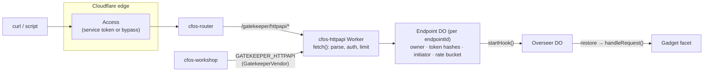
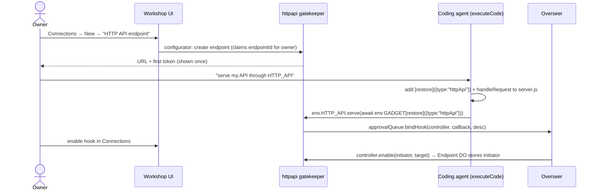
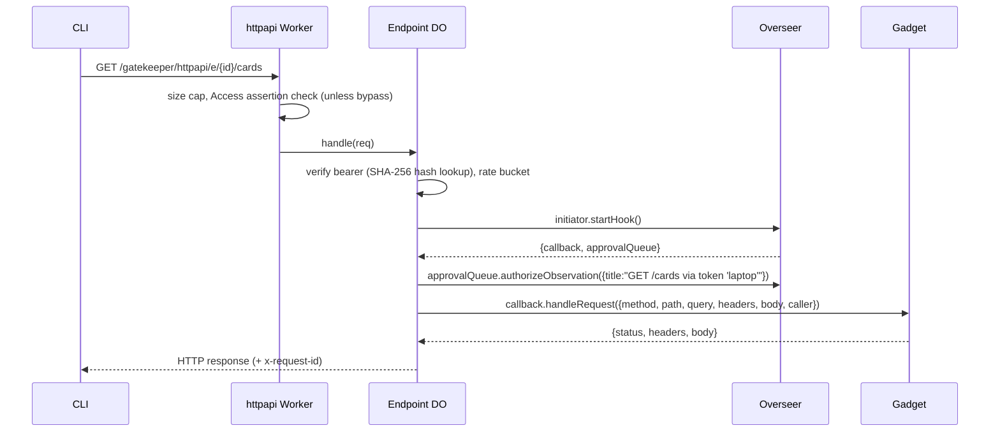

# Gadget HTTP API: a Gatekeeper that gives a gadget a REST endpoint

Written 2026-09-23 against starter `main` 3157780 and the submodule at e50a9058 (fork, `starter-openrouter` + `feat/websafe`). Status: **planned, nothing built**. The evidence and rejected options are in [`../research/gadget-http-api-options.md`](../research/gadget-http-api-options.md). This remains a separate proposal for gadget-specific automation. For durable organisational business data, use the authoritative [Organisation datastores plan](organisation-datastores.md): Postgres behind a domain service with typed RPC and a versioned HTTP API. The earlier [records-service alternative](external-records-service.md) is superseded.

## Goal

The owner of a workspace can say "give this gadget an API". They get a URL and a token, and can then run

```sh
curl -H "Authorization: Bearer $TOKEN" \
     -H "CF-Access-Client-Id: $CF_ID" -H "CF-Access-Client-Secret: $CF_SECRET" \
     https://cfos.surprisingly.ltd/gatekeeper/httpapi/e/k7q2…/cards?column=done
```

and the gadget's own `server.js` answers. This needs no kernel patch. It uses the same hook mechanism as the Email and Scheduler gatekeepers.

## Shape



### Setup (once per gadget)



### Each request



## Contract (goes in `src/types.d.ts` and becomes the binding's TypeScript surface)

```ts
/** Session the gadget or agent sees as env.HTTP_API. */
export interface HttpApiSession {
  /** Public base URL, e.g. https://host/gatekeeper/httpapi/e/<id> */
  getBaseUrl(): Promise<string>;
  /**
   * Register the request handler. `handler` must be a persistent stub from ctx.restore().
   * Replaces any earlier handler. Takes effect once the owner enables the hook in Connections.
   */
  serve(handler: RpcStub<HttpApiHook>): Promise<void>;
  /** Token metadata only, never secrets. */
  listTokens(): Promise<{ id: string; label: string; createdAt: number; lastUsedAt?: number; scopes: Scope[] }[]>;
}
export type Scope = "read" | "write";          // read = GET/HEAD only

export interface HttpApiHook {
  handleRequest(req: HttpApiRequest): Promise<HttpApiResponse>;
}
export type HttpApiRequest = {
  requestId: string;
  method: string;
  path: string;                                 // after /e/<id>, always starts with "/"
  query: Record<string, string[]>;
  headers: Record<string, string>;              // allow-list: content-type, accept, if-match, if-none-match, x-*
  body: string | null;                          // UTF-8; binary is refused with 415 in v1
  caller: { tokenId: string; tokenLabel: string; scopes: Scope[] };
};
export type HttpApiResponse = {
  status?: number;                              // default 200
  headers?: Record<string, string>;             // filtered: no set-cookie, no access-control-*
  body?: string | object | null;                // object → JSON + content-type
};
```

Gadget side (what the agent writes into `server.js`, following the prompt at `cloudflare-os/packages/workshop-backend/src/agent.ts:621-680`):

```js
import { DurableObject, RpcTarget, restore } from "cloudflare:workers";
export class Gadget extends DurableObject {
  async [restore](p) {
    if (p.type === "httpApi") return new Api(this);
    throw new TypeError("Unknown type: " + p.type);
  }
}
class Api extends RpcTarget {
  constructor(g) { super(); this.g = g; }
  async handleRequest(req) {
    if (req.method === "GET" && req.path === "/cards") return { body: await this.g.listCards() };
    return { status: 404, body: { error: "not found" } };
  }
}
```

**Token secrets never reach the gadget or the agent.** `createToken` and `revokeToken` are deliberately left out of the session. Tokens are minted and revoked only in the gatekeeper's resource configurator UI, where the owner is present. This matches how the Email configurator claims mailboxes.

## Files

New package `packages/gatekeeper-httpapi/`. Copy the skeleton from `packages/gatekeeper-websearch` (package.json, vite/vitest config, wrangler.jsonc, `types-code.ts` pattern) and the hook machinery from `cloudflare-os/packages/gatekeeper-email/src/email.ts:482-700`.

| File | Contents |
| --- | --- |
| `src/index.ts` | `fetch` for `/gatekeeper/httpapi/e/:id/*` (and a 404 for everything else). Re-exports the entrypoints and DOs. |
| `src/vendor.ts` | `GatekeeperVendor` with a single resource, **HTTP API endpoint**, URL pattern `${BASE_URL}/e/*`, `suggestedBindingName: "HTTP_API"`, `tsType: "HttpApiSession"`, `hookTsType: "HttpApiHook"`. Model it on `packages/gatekeeper-chat/src/vendor/` and email's `GatekeeperVendor`/`UserAccount`/`GatekeeperUserImpl`. |
| `src/configurator/` | Create an endpoint (random 128-bit id, base32) and claim it for `userAccountId`. Mint a token with label, scopes and an optional expiry, shown once. List and revoke. Copy `EmailMailboxConfiguratorUI` in email.ts. |
| `src/session.ts` | `HttpApiSessionImpl`: `serve()` → `approvalQueue.bindHook(ctx.exports.HttpApiHookController({props}), handler, {title:"Serve HTTP API", description:`Answer requests to ${url}`})`. |
| `src/hook-controller.ts` | `enable(initiator, _target)` / `disable()` forward to `Endpoint.setInitiator(initiator \| null, userAccountId)`. The `_target` parameter **must be declared** (RPC validation, `gatekeeper.ts:1255-1270`). |
| `src/endpoint-do.ts` | SQLite DO holding `owner`, `initiator` (KV, like email), a `tokens` table (`id, label, sha256, scopes, created_at, expires_at, last_used_at, revoked`) and a token bucket. `handle(req)` does auth → scope → rate → `using r = initiator.startHook()` → `authorizeObservation` → `callback.handleRequest` → shape the response. |
| `src/http.ts` | Parse and bound the request (method allow-list, `maxBodyBytes`, UTF-8 only, header allow-list). Shape the response (status 100–599, header deny-list, JSON encoding). Map errors: 401 bad token, 403 scope, 404 no endpoint, 409 hook disabled or not served, 413, 415, 429 (`Retry-After`), 502 gadget threw, 504 over 30 s. |
| `src/access.ts` | Copy `packages/gatekeeper-chat/src/access.ts`. Require a valid `cf-access-jwt-assertion` (a service-token JWT has `common_name`, not `email`) unless `bypassAccess` is set. |
| `__tests__/` | See Tests. |
| `README.md` | Setup, the curl example, the gadget snippet, Access notes. |

Starter wiring:

| File | Change |
| --- | --- |
| `deployment.jsonc` | `workers.httpApi: {name: "cfos-httpapi"}` and a block `"httpApi": { "enabled": false, "maxBodyBytes": 1048576, "requestsPerMinute": 120, "bypassAccess": false }`, with comments in the file's style. |
| `scripts/deployment-config.ts` | Parse and validate the block, as for `webSearch`. |
| `scripts/deploy.ts` | When enabled: deploy the Worker (vars `BASE_URL = ${publicBaseUrl}/gatekeeper/httpapi`, `CF_ACCESS_ISS/AUD`, limits). Add a **router** binding `GATEKEEPER_HTTPAPI` (default entrypoint, like `GATEKEEPER_CHAT` at `:641`) and a **Workshop** binding `GATEKEEPER_HTTPAPI`, `entrypoint: "GatekeeperVendor"` (like `:708-735`). The same binding name on both gives the path `/gatekeeper/httpapi` (`router/src/index.ts:29-31`). |
| `scripts/deploy.test.ts` | Cases for enabled and disabled. |
| `docs/customization.md` | A short "HTTP API" section. |
| `pnpm-workspace.yaml` / root `package.json` | Add the package to `check` and `test`. |

## Decisions already made (do not revisit without cause)

- **Gatekeeper and hook, not a fork patch.** This is the canonical way in, and it survives upstream rebases.
- **Bearer tokens are stored as SHA-256 hashes**, compared in constant time, formatted `cfos_<endpointIdPrefix>_<32 random bytes b64url>` (the prefix is for lookup and for secret scanners). Build test fixtures at runtime; see the fake-secrets memory: gitleaks and GitHub push protection both catch literal token shapes.
- **Keep both layers**: Access (a service token with a Service Auth policy) at the edge, plus the endpoint token. `bypassAccess: true` exists only for webhook senders that cannot set headers, and it needs a path-scoped Access app with Bypass on `/gatekeeper/httpapi/e/*` (set up in the dashboard; wrangler's OAuth token cannot call the Access API).
- **One observation per request** (`title: "<METHOD> <path> via '<label>'"`). The body goes in `description`, truncated to 2 KiB. If the activity log gets too noisy, revisit this before adding sampling.
- **The Endpoint DO serializes requests.** The gadget already handles about 45–50 calls a second one at a time. The default of 120/min per endpoint leaves plenty of headroom.
- **The caller is not a person.** `caller` carries the token's label. Gadgets must not attribute changes to it as though a signed-in account made them.

## Gotchas (from memory of real-platform failures)

- **Store the initiator, never the callback.** Call `startHook()` for every request and `using`-dispose the result (email.ts:668-692). Undisposed stubs log warnings in production and **crash local workerd**.
- A persistent `ctx.exports.X({props})` stub has **no `dup()`** and no `Symbol.dispose`. Don't `dup()` the initiator.
- **Service stubs cannot cross two local `wrangler dev` processes** ("channel token failed authentication"). For local runs, put the gatekeeper in the platform's process, the same way chat does with `CHAT_IN_PLATFORM=1`. Read `packages/gatekeeper-chat` dev scripts and `packages/blueprint-kanban/e2e/start-local-platform.sh`. `pnpm run-local` fails on WSL.
- Don't name any RPC method `connect`.
- vitest-pool-workers builds `ctx.exports` only from **named** exports of the test entry.
- `pnpm deploy` while the local platform is running breaks the dev server. Restart it afterwards.
- Node comes from fnm (`eval "$(fnm env)" && fnm use v24.21.0`).

## Tests

1. **Unit (vitest-pool-workers)**: token mint, hash and verify, expiry, revoke. Scope enforcement. Body and header limits. The response shaper's deny-list. The token bucket. Error mapping, using a fake `initiator` whose `startHook()` returns a fake callback and a recording approval queue. The hook controller's owner check (a second account cannot `setInitiator`).
2. **Local platform e2e**: a fixture gadget with `[restore]` and `handleRequest`. Register it through `executeCode` (or call `serve()` from the gadget), enable the hook, `curl` the local URL, and assert the body and the observation in `listActions()`. Then disable the hook → 409, and revoke the token → 401.
3. **Production (signed in, Harry)**: create a service token and a Service Auth policy, then enable `httpApi`, `pnpm deploy`, create an endpoint on a Board, and run the curl in Goal. Check the Connections hook toggle and the activity log.

## Phases

1. Package skeleton, vendor, configurator and session with `serve()` → `bindHook` (no HTTP yet). Unit tests.
2. Endpoint DO and `fetch` path: auth, limits, delivery, error mapping. Unit tests.
3. Deploy wiring with `enabled: false` by default. `pnpm check` passes.
4. Local e2e with a fixture gadget. README and customization docs.
5. Optional: a Board gadget read-only API (`GET /columns`, `GET /cards`) as the showcase, and a `scripts/gadget-api` curl wrapper that reads `CFOS_API_TOKEN` / `CF_ACCESS_CLIENT_*` from the environment.

## Open questions for the implementer to settle in code

- Does the configurator context expose the owner's `userAccountId` the way email's `GatekeeperUserImpl` props do? If so, use it for the claim.
- Can a hook callback return a value through `startHook().callback`? Email and Scheduler return `void`. Workers RPC should pass return values through; prove it in phase 2 before building on it.
- Streaming bodies (`ReadableStream`) are out of scope for v1. Revisit if an export endpoint is wanted.
