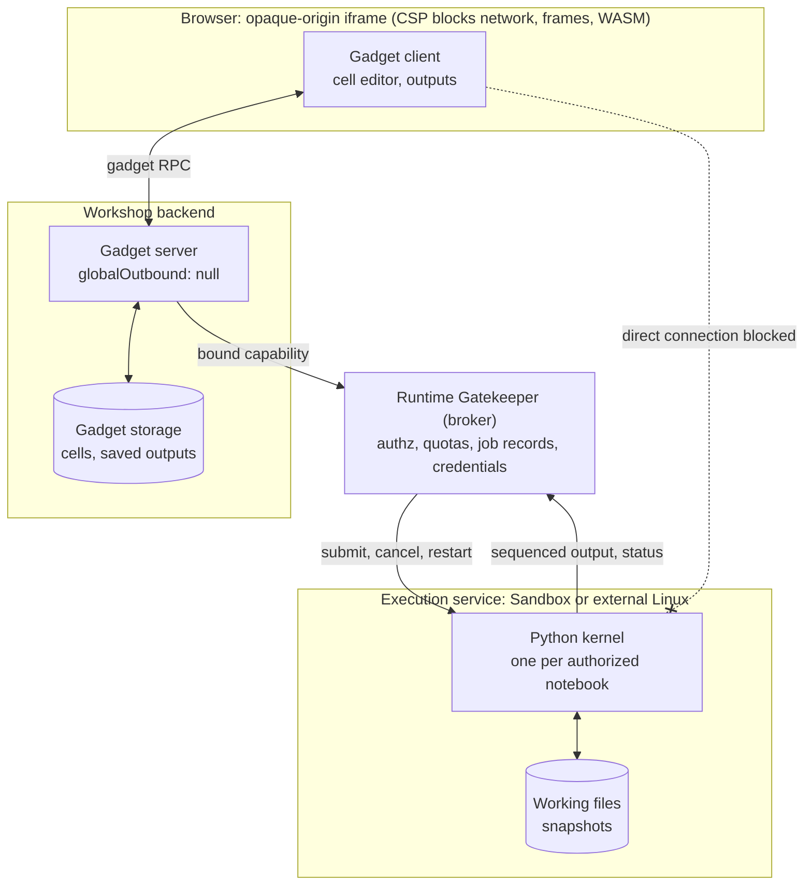
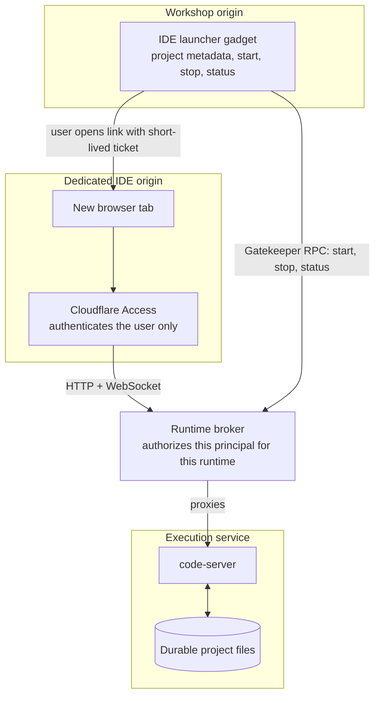
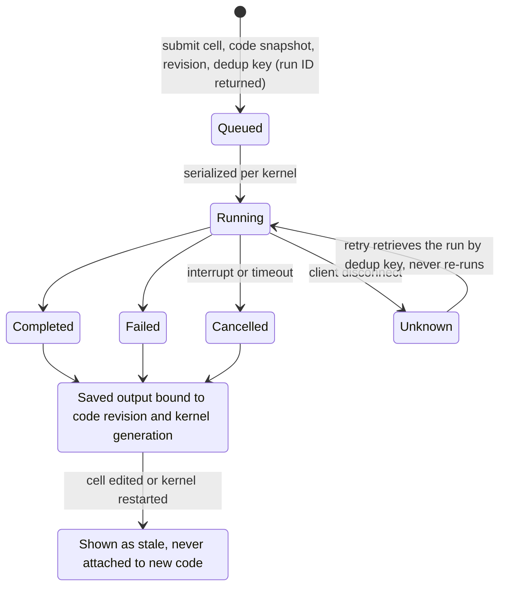

# Notebook and IDE blueprints: feasibility and implementation

Status: research and proposed implementation only, 2026-09-16. Inspected starter `843848c` and pinned Cloudflare OS `90f05910`. No runtime prototype or deployment was performed.

**Yes, both are feasible as products built around blueprints. A notebook interface or lightweight code editor can be an ordinary blueprint; a real Python kernel or code-server needs a separately provisioned execution service.** Installing a `.gadget` archive cannot install a Linux runtime, grant container bindings, or make an existing Jupyter/code-server website work inside the gadget frame.

## Recommendation

Build a native notebook blueprint first, with a narrowly scoped runtime Gatekeeper providing Python execution. Keep notebook cells and saved results in gadget storage; keep kernels and working files in a separate execution service. Then reuse that service for an IDE launcher blueprint that opens code-server on a dedicated, authenticated origin. Defer embedding the complete IDE inside Workshop until that is a demonstrated product requirement.

This gives the notebook an integrated Workshop experience and lets the full IDE retain its filesystem, terminal, extensions, and normal browser networking. Neither requires weakening every gadget's sandbox. Cloudflare Sandbox is a plausible execution backend, but an external Linux service implementing the same broker contract is also viable. The current Cloudflare documentation recommends the Sandbox 1.0 preview for new applications; pin an SDK/image pair and evaluate that recommendation in a deployment spike rather than mixing stable and preview examples. [Sandbox overview](https://developers.cloudflare.com/sandbox/)

| Product | Feasibility in this checkout | Required work | Recommendation |
| --- | --- | --- | --- |
| Notebook editor, Markdown and saved outputs, `.ipynb` import/export | High; ordinary gadget UI and storage | New blueprint, document model and format adapter | First deliverable |
| Python notebook with state across cells | High in principle; execution is outside the gadget | Runtime Gatekeeper, isolated kernel, job protocol and persistence | Preferred execution path |
| JupyterLite/Pyodide inside the current gadget | Not a drop-in | WASM/worker/assets integration and narrowly reviewed host changes | Defer; useful if browser-only execution becomes a priority |
| Complete JupyterLab | Feasible as a separate application | Jupyter server, kernels, authenticated HTTP/WebSocket proxy and durable files | Alternative when full Jupyter compatibility matters |
| File tree and source editor with IDE-like layout | High as an ordinary blueprint | Editor bundle, file model and persistence | Useful, but does not supply shell/debugging/extensions |
| Actual code-server/OpenVSCode Server | Feasible as a runtime-backed application | Linux service/container, auth, WebSockets, storage and lifecycle | Launch from a blueprint in another tab initially |

Research supporting these conclusions:

- [Blueprint integration and source trace](../research/notebook-ide-blueprint-integration.md).
- [Notebook runtime options](../research/notebook-blueprint-runtime-options.md).
- [Browser IDE runtime options](../research/browser-ide-runtime-options.md).

## Why the blueprint alone is insufficient

The current [gadget renderer](../../cloudflare-os/packages/workshop-frontend/src/GadgetUI.tsx) creates an opaque-origin iframe. Its CSP blocks direct network connections and nested frames, and it supplies neither normal remote asset loading nor WASM compilation permission. The backend's `loadGadgetWorker` in [overseer.ts](../../cloudflare-os/packages/workshop-backend/src/overseer.ts) loads JavaScript modules with `globalOutbound: null`; it does not provide Linux processes, a terminal, or a Python environment. Adding Node compatibility to the deployment Worker would not turn this gadget loader into a Linux host.

The existing RPC and Gatekeeper boundary is the useful extension point: the gadget calls a bound capability, whose trusted implementation talks to the execution service. The [router](../../cloudflare-os/packages/router/src/index.ts) can already dispatch `/gatekeeper/<name>` to a corresponding service binding, but this is routing, not workspace authorization. The [starter deploy script](../../scripts/deploy.ts) explicitly constructs its Worker and binding set, so a new execution Gatekeeper also requires wrapper configuration, build, validation and deployment changes.

Blueprints copy application source and binding requirements. They do not copy gadget storage, runtime files, credentials or a running kernel. A notebook **template** can seed example cells from its source on first launch; duplicating a user's actual notebook is a separate data export/import operation. Existing instances also do not automatically acquire new blueprint code. [Blueprint semantics](../../cloudflare-os/docs/blueprints.md)

## Proposed architecture

For the notebook, the path is: gadget client → existing gadget RPC → gadget server → bound runtime capability → isolated Python kernel. Results return through bounded subscriptions or polling, then become saved notebook outputs. The browser never receives infrastructure credentials or unrestricted container APIs.

For the IDE, the blueprint stores project metadata and provides start, stop, status and launch controls. A user-initiated link opens an authenticated broker on a dedicated origin, which authorizes access to that particular runtime before proxying code-server HTTP and WebSockets. The current frame permits such popup navigation. A launch ticket, if used, must be short-lived, single-use and tied to an authenticated authorized principal; a project ID alone is never authority. This identity handoff is a design/spike requirement, not an existing Workshop API.

Use a runtime per explicitly authorized project or notebook. Do not equate a cloud container ID, a user-supplied gadget ID, or a cursor display name with authorization. Start with owner-only execution and IDE launch; add shared execution only after the broker can verify collaborator grants and revocation. Workshop collaborators may already call exposed gadget methods: hiding a Run button does not enforce this policy.

Use a separate origin for arbitrary IDE content and application previews so they do not acquire the Workshop application's browser origin. Access sign-in authenticates a user but does not decide which runtime they may open. New origin, Access and billing configuration require an explicit deployment decision during implementation.

## Notebook implementation

Create `packages/blueprint-notebook` using the Board/Whiteboard package, bundle and archive conventions. Ship a stable `format.notebook` sidecar/archive pair in `formats/`; use an existing output icon from the closed icon set. Package UI dependencies at build time; do not depend on CDN imports from inside the frame.

Store an ordered list of cell IDs, individually versioned Markdown/code cells, notebook metadata, and bounded output records. Reuse the existing gadgets' revision checks, callback disposal and reconnect patterns. Start with per-cell conflict detection rather than simultaneous character-level editing. The Workshop's Yjs source history does not automatically synchronize the notebook's application data.

Expose document methods such as `getNotebook`, `insertCells`, `updateCell`, `moveCell`, `deleteCell`, and `exportNotebook` for both humans and agents. These names are proposed, not existing platform APIs. Add execution methods only once the broker policy is defined.

Execution needs an asynchronous job contract: submit a cell ID, immutable code snapshot, source revision and deduplication key; return a run ID promptly; retrieve sequenced output and final status; support cancel and kernel restart. Serialize runs within a kernel. Associate outputs with their exact code revision and kernel generation so editing a cell or restarting the runtime cannot silently attach stale results to current code. A retry after an ambiguous disconnect must retrieve the prior run or show an unknown outcome, never blindly repeat side effects.

Persist the notebook document independently of the kernel. Show separate states for document saved, execution running, kernel disconnected and kernel reset. Python variables disappear on kernel/container loss; restoring files does not restore memory. Default to explicit Run and Restart actions, with no execution on import/open. Start with text, errors and capped images; sanitize rendered Markdown/HTML and defer active widgets, arbitrary scripts and complex MIME renderers.

Implement bounded `.ipynb` import/export with explicit handling of unsupported cell metadata, attachments and MIME types. Preserve compatible metadata where practical and disclose dropped content. Exporting saved outputs is a user choice. Large datasets and artifacts belong in broker-owned object storage with authorized retrieval, not a single gadget storage value or the public blueprint-content bucket.

## Runtime Gatekeeper and storage

Create a dedicated wrapper-owned package, tentatively `packages/gatekeeper-runtime`. Do not inherit the permissive observer policy or read-only action handling of the [custom example](../../packages/custom-gatekeeper/README.md). Execution changes files, consumes resources and can make network requests: its agent approval, simulation and observation behavior needs an explicit contract. Prefer a capability restricted to one project and runtime profile over an arbitrary shell/network management API.

The broker owns runtime allocation, authorization, job records, quotas, timeouts, output truncation, cancellation, idle suspension and cleanup. Infrastructure credentials stay in the broker. Define allowed outbound access and credential injection separately from the gadget's existing outbound restriction: Linux execution does not automatically inherit that restriction. Verify collaborator identity propagation and Gatekeeper resource scoping before enabling execution from a shared gadget; fail closed if that mapping is unavailable.

Treat container disks and live processes as disposable. Choose an authoritative project snapshot/object store or durable external filesystem and specify checkpoint timing, recovery, concurrent-writer rules and deletion. Use a local working directory for Git and package installation; do not assume an object-store mount behaves like a complete POSIX development disk. Record the image/environment version alongside saved notebooks for reproducibility. Runtime backup, notebook export and blueprint publication are three different operations.

Add an explicit execution-service configuration to `deployment.jsonc` and `scripts/deploy.ts`, including Worker/service bindings and any container/DO/storage resources. Keep generated Wrangler files generated. A remote runtime host avoids Cloudflare container provisioning but still needs broker authentication, outbound credentials and lifecycle integration. Both paths add ongoing operations and compute cost; enforce concurrency and idle limits before enabling general use.

## Delivery sequence and acceptance gates

1. **Prove the boundaries.** Bundle the intended cell editor inside a real local gadget; verify typing, imports/exports, callback recovery and capped rich outputs. Separately prove one Python kernel and one code-server session behind an authenticated runtime broker. Verify HTTP assets, WebSocket reconnect, authorization rejection and restart behavior. No production rollout is needed for these spikes.
2. **Ship the document-only notebook.** Implement cells, conflict handling, persistence, import/export and agent document methods. Confirm a second gadget instance has independent data, and a new blueprint instantiation does not inherit prior notebooks or runtime identifiers.
3. **Add owner-scoped Python execution.** Prove cross-cell state, ordered output, interrupt, timeout, duplicate submission handling, output flood limits, stale-result labeling and cold restart. Verify another user cannot execute against or read the runtime by guessing an ID or reusing a revoked capability. Resolve the identity bridge before calling this complete.
4. **Add the IDE launcher.** Reuse runtime provisioning and persistence; verify saved files survive the advertised stop/start path, terminal behavior is correct, extension installation works for the chosen registry, and arbitrary previews stay isolated from Workshop. Define behavior when the gadget is deleted or its runtime binding is revoked.
5. **Consider closer integration.** Add shared kernels, collaborative file editing, richer notebook MIME support or an embedded trusted IDE surface only after their requirements justify the extra authority and protocol work.

Run meaningful package tests, the real-platform gadget harness and the starter's `pnpm check` during implementation. A browser harness alone cannot prove compatibility with the real gadget CSP. Before production, verify provider availability, current limits/pricing, pinned SDK/image compatibility, restoration after runtime loss, denied-user paths and cost controls on the actual account. None of those live checks was performed in this research task.

## Decisions to settle when implementation starts

The proposed default is Python first, native notebook UI, owner-only execution, runtime storage separate from gadget documents, and code-server opening in another tab. Decide whether full Jupyter compatibility, offline/browser-only Python, shared kernels, a specific extension registry, or embedding the IDE is essential before estimating the larger build. Those choices change the architecture substantially.

The highest-risk unknowns are the broker's Workshop identity/capability handoff, crash-safe filesystem persistence, and authenticated HTTP/WebSocket proxy behavior. The notebook UI and blueprint packaging follow patterns already present in this repository. Resolve the three integration risks with small prototypes before committing to a full IDE implementation.
