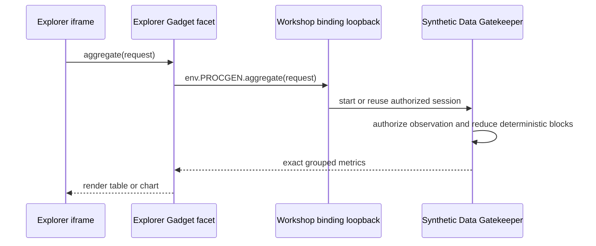

# Build a Data Explorer for synthetic datasets

This plan defines the first reference consumer of the [Procedural Generation Gatekeeper](procedural-generation-gatekeeper-blueprint.md): a read-only Gadget for inspecting schemas, records, relationships, and exact aggregates. Its purpose is to prove the shared service contract and show how other blueprints can consume the same finite synthetic database.

The [performance and cost research](../research/procedural-data-performance-and-cost.md) explains why the explorer exposes only bounded pages and advertised aggregate shapes.

**Status:** Proposed. Implementation follows approval of the Gatekeeper RPC contract.

## Goal and audience

Build a polished data browser that helps a person understand a synthetic dataset before using it in another demo. The explorer should also serve as working reference code for blueprint authors who want to connect dashboards, maps, timelines, or domain-specific tools to the generator.

The explorer is not the source of data. It stores only presentation state, such as the selected collection, visible fields, active query, cursor history, aggregate view, and open inspector. Every schema, record, and metric comes from its `PROCGEN` binding.

## Experience principles

- Make the connected dataset visible: scenario, version, seed label, size profile, and exact collection counts
- Describe rows as **Generated on demand**, not **0 Bytes Stored**
- Prefer declared indexed queries over a SQL-like interface the service cannot honor
- Make exact aggregates a first-class path for charts and summary cards
- Turn relationships into navigation, not raw foreign-key text
- Keep results reproducible across every Gadget bound to the same dataset resource
- Explain service limits where a person encounters them

## User journey

1. Add the blueprint and connect a Synthetic Data resource
2. Choose or configure a scenario, version, seed, and size profile in the connector flow
3. Inspect collections and their exact row counts
4. Open a collection in canonical order
5. Apply predicates supported by its declared indexes
6. Calculate supported totals or grouped metrics, such as `sum(orders.total_minor)` by status
7. Inspect a record and follow its relationships
8. Open another bound Gadget that visualizes the same dataset

Changing the dataset means changing the `PROCGEN` connection, not editing an argument inside the explorer. This keeps the selected synthetic database aligned with the capability shown in Cloudflare OS Connections.

## Architecture



The client iframe cannot call the Gatekeeper or network directly. Its strict Content Security Policy uses `connect-src 'none'`. The Gadget's server code receives `PROCGEN` and exposes a narrow client-facing RPC API.

Do not describe the Gadget as owning a separate Durable Object. In the current runtime, a Gadget runs as a facet within the workspace Overseer Durable Object and receives Gatekeeper loopbacks for declared bindings.

## Blueprint contract

Package the source under `packages/blueprint-procgen-explorer` and publish it with a stable `blueprintId`, proposed as `format.procgen-explorer`. Its archive must declare a required `PROCGEN` binding with the service's `SyntheticDataSession` type.

The server-side Gadget API should be smaller than the Gatekeeper API:

```typescript
export interface ExplorerState {
  collection?: string;
  query?: QueryRequest;
  aggregate?: AggregateRequest;
  cursorHistory: string[];
  selectedRecordId?: string;
}

export interface ExplorerGadget {
  describeDataset(): Promise<DatasetDescription>;
  getState(): Promise<ExplorerState>;
  listCollections(): Promise<CollectionSummary[]>;
  describeCollection(name: string): Promise<CollectionSchema>;
  query(request: QueryRequest): Promise<QueryPage>;
  aggregate(request: AggregateRequest): Promise<AggregateResult>;
  getRecord(collection: string, id: string): Promise<Record<string, unknown> | null>;
}
```

Validate client input before forwarding it. Treat schemas and records as untrusted at the rendering boundary: escape text, cap nested JSON rendering, and never interpret generated strings as HTML.

## Interface design

The desktop layout uses four stable regions:

- **Dataset bar:** scenario, version, seed label, size profile, and **Generated on demand** status
- **Collection rail:** collection name, description, field count, and exact record count
- **Workspace:** rows or aggregates, supported filters, visible fields, and cursor navigation
- **Inspector:** complete record fields, JSON, outgoing relationships, and reverse relationships

On narrow screens, replace the collection rail with a drawer and open the inspector as a full-screen sheet. Preserve the current query when either surface closes.

```text
┌──────────────────────────────────────────────────────────────────────────────┐
│ Commerce · v1 · demo-4242 · medium             Generated on demand          │
├──────────────────┬───────────────────────────────────────────────────────────┤
│ Collections      │ orders · 1,000,000 records              Rows | Metrics  │
│                  │ customer_id = 1420                         Clear filters │
│ customers        ├──────────┬───────────────┬──────────┬────────────────────┤
│ products         │ id       │ customer      │ total    │ status             │
│ orders           ├──────────┼───────────────┼──────────┼────────────────────┤
│ order_items      │ ord_…01  │ ↗ cust_01420  │ £142.50  │ delivered          │
│ events           │ ord_…02  │ ↗ cust_01420  │ £19.99   │ shipped            │
│                  ├──────────┴───────────────┴──────────┴────────────────────┤
│                  │ 50 records                              Previous  Next   │
└──────────────────┴───────────────────────────────────────────────────────────┘
```

Follow the existing frontend stack where practical: React, Kumo UI, Phosphor icons, and Vite. Use semantic table markup when results are tabular. Add virtualization only if measurement shows that bounded pages need it.

## Query and aggregate builders

Build controls from `CollectionSchema.indexes` and `CollectionSchema.aggregates`. Do not expose free-form filters or arbitrary SQL and reject most submissions later.

For row queries:

- Show only supported fields and operators
- Parse timestamps, numbers, and booleans with type-specific controls
- Display validation errors beside invalid values
- Reset cursor history when the collection, selected fields, or predicates change
- Keep current results visible while the next page loads

For metrics:

- Show only advertised functions, fields, filters, and groupings
- Label every result **Exact**
- Format integer minor units as currency only when schema metadata supplies a currency
- Cap grouped results and show the service limit before submission
- Offer a table view first, then small chart types suited to the returned grouping

Use opaque cursor navigation. Do not calculate “page 1 of 20,000” unless the service supports random page access. **Previous** uses local cursor history; **Next** uses `nextCursor`.

## Relationship navigation

Render any field with `references` metadata as a link. Selecting it opens the target record without guessing collection names or ID formats.

Reverse navigation requires declared relationship and index metadata. When `orders.customer_id` is indexed, show **View orders** on a customer. The action opens the child collection with an equality predicate. Do not claim constant-time traversal unless benchmarks and the ID scheme support it.

The inspector should show:

- Field name, type, formatted value, and raw value
- Primary-key status
- Outgoing relationship targets
- Supported reverse-relationship actions
- Copyable JSON with a size cap

Do not expose internal mixed seeds or generation state. The connected dataset description is sufficient for reproduction.

## States and accessibility

Design these states before the populated grid:

- `PROCGEN` binding missing or disconnected
- Dataset resource invalid or unsupported
- Collection empty
- Query valid but no records match
- Aggregate shape unsupported
- Cursor expired, invalid, or tied to another query
- Request exceeds a row, field, metric, or group limit
- Gatekeeper or RPC failure with retry

The grid must support keyboard navigation without trapping focus. Give relationship controls descriptive names, preserve focus when the inspector closes, announce result-count changes, and avoid relying on color for status or errors. Use `Intl.NumberFormat` and `Intl.DateTimeFormat` for display while keeping raw values available.

## Local state and sharing

Persist the selected collection, visible fields, normalized predicates, metric configuration, and selected record ID. The dataset identity comes from the Gatekeeper binding. Cursors are transient service tokens and should not become a durable deep-link format.

The Gatekeeper observer policy remains the source of authority for collaborators. Do not cache generated record pages or aggregate results in durable Gadget storage unless a later snapshot design explicitly accounts for observation semantics.

## Packaging and deployment

Ship the explorer only after the Gatekeeper is available in the deployment. Add the source package, build and test its archive, then import the committed `.gadget` and sidecar into the wrapper-owned `formats/` directory.

The sidecar owns the title, description, output metadata, author, and revision. Keep `blueprintId` stable after deployment. Every archive code change must bump the revision through the repository's import or pack workflow.

Because `formatBlueprintsDir` replaces the upstream format set, retain existing format pairs when adding the explorer. Do not point it at a directory containing only this blueprint.

## Verification plan

Test against a deterministic fake session first, then the real Gatekeeper:

- **Binding:** a new instance requests or receives the required `PROCGEN` resource
- **Determinism:** reloads and independent explorers show the same records and metrics for one resource
- **Finite bounds:** exact collection counts match the connected size profile
- **Schema-driven UI:** fields, predicates, aggregates, and relationships come from metadata
- **Aggregate equivalence:** displayed metrics match reference row reductions on the small profile
- **Pagination:** forward and previous navigation produce no duplicates, gaps, or stale results
- **Relationships:** forward and reverse navigation resolve expected records
- **Failure states:** invalid input, limits, expired cursors, unsupported aggregates, and RPC failures are actionable
- **Security:** generated strings render as text, oversized JSON is bounded, and the browser makes no network requests
- **Accessibility:** keyboard, screen reader, focus, contrast, zoom, and narrow layouts work
- **Reuse:** a second non-explorer Gadget renders the same dataset and aggregate results

Run package tests, type checks, archive freshness checks, root `pnpm check`, and browser-level tests. Measure interaction latency before setting targets.

## Delivery stages

1. Approve the Gatekeeper resource and RPC contracts
2. Prototype against a typed fake session
3. Build schema, row query, aggregate, cursor, and relationship flows
4. Connect the real `PROCGEN` binding
5. Add empty, invalid, limit, and failure states
6. Package the blueprint and add its format sidecar
7. Verify a second UI against the same dataset resource

## Success criteria

The explorer succeeds when it teaches both the dataset and the integration model. A person can inspect finite data, calculate exact supported metrics, follow relationships, and see the same results in another UI. A blueprint author can copy the binding pattern without importing explorer code or reimplementing generation.
