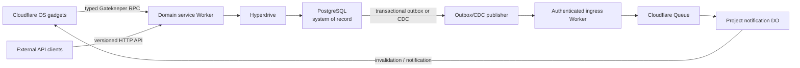

# External API Plan A: Postgres as the system of record

> **Superseded (2026-09-23)** by [Organisation datastores: implementation plan](../plans/organisation-datastores.md)
> and its [research and decisions](organisation-datastores-decisions.md). Retained as historical
> analysis. The replacement develops this domain-service direction into an ownership, lifecycle,
> permissions, UI, registry and safely parallelizable implementation plan.

Written 2026-09-23 against starter `main` at `7d39f48` and the pinned `cloudflare-os`
submodule at `e50a9058`. This is an alternative to publishing a gadget's Durable Object state and
business logic directly through the HTTP API proposed in
[`gadget-http-api-options.md`](gadget-http-api-options.md) and
[`../plans/gadget-http-api.md`](../plans/gadget-http-api.md).

## Recommendation

For a durable, multi-user product such as a Jira replacement, make PostgreSQL the authoritative
datastore. Durable Objects remain useful for coordination, presence, subscriptions and
reconstructable caches, but they should not become a second writable copy of the same business
records.

Avoid bidirectional Durable Object/Postgres synchronization. It creates two sources of truth and
requires conflict resolution, schema coordination, replay, reconciliation and recovery across both
systems. CDC is best used one way, for notifications, analytics, search indexing or rebuilding a
cache.

## Recommended architecture



Postgres owns projects, issues, comments, users, permissions, audit history, custom fields and
schema migrations. Durable Objects hold only state that can be reconstructed, such as active
subscribers, presence, short-lived caches, deduplication markers and realtime fan-out state.

Cloudflare Hyperdrive supports Postgres on Neon, AWS RDS/Aurora, Supabase and other compatible
providers. It handles distributed connection setup and connection pooling. Placement can run a
query-heavy Worker closer to the database. For transactional application reads, query caching
should normally be disabled because writes do not invalidate cached reads.

- [How Hyperdrive works](https://developers.cloudflare.com/hyperdrive/concepts/how-hyperdrive-works/)
- [Supported databases and features](https://developers.cloudflare.com/hyperdrive/reference/supported-databases-and-features/)

## Architecture comparison

| Concern | Gadget/DO as system of record | Postgres as system of record | Bidirectional DO/Postgres sync |
| --- | --- | --- | --- |
| Per-project coordination | Excellent | Requires service logic | Complex |
| Cross-project queries and reporting | Awkward | Excellent | Possible, but eventually consistent |
| Relational integrity | Per-object SQLite only | Full PostgreSQL constraints and transactions | Split across two systems |
| Migrations | Custom, potentially per object | Mature migration ecosystem | Both schemas must evolve together |
| External integrations and BI | Requires export/API work | Standard SQL ecosystem | Consumers must understand lag |
| Realtime presence and fan-out | Excellent | Requires a realtime layer | Possible, but complicated |
| Backup and recovery | DO SQLite has 30-day PITR, but Cloudflare-specific tooling | Standard managed-Postgres backup, PITR, replicas and administration | Recovery must reconcile both sides |
| Portability | Application-specific | Relatively strong | Poor |
| Operational simplicity | Strong for small systems | Another service and failure domain | Worst option |
| Enterprise fit | Good for coordination atoms | Best for durable business records | Generally avoid |

Durable Object SQLite is not unsafe or disposable. It provides strong consistency, transactions
and 30-day point-in-time recovery. Its disadvantage here is primarily the data model and operational
ecosystem: every object has private storage, so global reporting, joins, administration, bulk
migrations, exports and external tooling require bespoke work.

- [Durable Object SQLite and PITR](https://developers.cloudflare.com/durable-objects/api/sqlite-storage-api/)

## Advantages of external Postgres

- Standard relational modelling, constraints, joins, transactions, indexing, full-text search and
  extensions.
- Easier cross-project reporting, portfolio views, audit exports, analytics and integrations.
- Mature backup, PITR, replication, migration, monitoring and database-administration tooling.
- One source of truth shared by gadgets, an external API, automation, mobile clients and reporting.
- Better long-term portability between Neon, RDS, Aurora, self-hosted Postgres and other compatible
  services.
- Schema governance is independent of individual gadget code.
- Easier publication of a stable, versioned headless API.
- A normalized core model can coexist with `JSONB` custom fields without making the entire system
  schemaless.

Hyperdrive pooling and caching are included with Workers Paid rather than charged as a separate
query service. The database itself, storage, backups, compute and any provider-side transfer remain
separate costs.

- [Hyperdrive pricing](https://developers.cloudflare.com/hyperdrive/platform/pricing/)

## Disadvantages

- Every uncached operation crosses from Cloudflare to a regional database. Hyperdrive removes much
  of the connection overhead, but not the query round trip.
- Database availability becomes application availability. Pool exhaustion, failover, credentials,
  migrations and regional incidents become operational concerns.
- Tenant isolation must be rigorous. A missing tenant condition or incorrect RLS policy can expose
  substantially more data than an isolated Durable Object error.
- Schema migrations become coordinated product releases. Arbitrary gadgets must not issue DDL
  against a shared production database.
- Credentials and rotation belong to the service Worker. Gadgets must never receive a connection
  string.
- Realtime updates require an additional event path.
- A generic SQL or PostgREST interface can permit expensive queries or expose more columns and
  relationships than intended.
- External Postgres has baseline operational and monetary cost that a small, idle DO-backed gadget
  may avoid.

## Where PostgREST fits

PostgREST is plausible, but raw tables should not be exposed directly to gadgets or agents.

```text
private schema: tables and internal functions
api schema:     constrained views and RPC functions
PostgREST:      exposes only the api schema
API Worker:     authentication, rate limits and API versioning
Gatekeeper:     typed capability API for gadgets and agents
```

PostgREST delegates authorization to PostgreSQL roles and row-level security. That can be powerful,
but it makes database grants, views, functions, JWT claims and RLS policies part of the public
security boundary. Its documentation recommends a narrowly privileged authenticator role and
explicit schema, table and function permissions.

- [PostgREST authentication](https://docs.postgrest.org/en/v12/references/auth.html)
- [PostgREST database authorization](https://docs.postgrest.org/en/v12/explanations/db_authz.html)

Its main strengths are rapid REST generation, filtering, OpenAPI discovery and database-centric
authorization. Its main weaknesses are:

- The public API shape becomes coupled to the database schema.
- Renames and migrations can break clients.
- Schema metadata is cached and must be reloaded after relevant DDL changes.
- RLS, view-owner behavior, `SECURITY DEFINER` functions and default function privileges are easy
  to get subtly wrong.
- It does not by itself provide domain-level idempotency, workflow orchestration, rate limits or
  safe business operations.

For a project-management service, ordinary reads can use constrained views, while writes should be
domain functions or service methods such as `create_issue`, `transition_issue` and `assign_issue`,
rather than arbitrary table mutation.

## CDC: use it narrowly

CDC is useful for one-way event propagation:

- Postgres to a search index.
- Postgres to analytics.
- Postgres to realtime invalidation.
- Postgres to a rebuildable DO projection.
- Postgres to an integration or webhook pipeline.

It should not normally copy every row into gadget Durable Object storage.

PostgreSQL logical replication captures DML but does not automatically replicate DDL or sequences;
schema changes must be coordinated separately. Replication also introduces slots, lag monitoring,
privileged replication credentials, initial snapshots and failure recovery.

- [PostgreSQL logical-replication restrictions](https://www.postgresql.org/docs/17/logical-replication-restrictions.html)

For application-controlled writes, prefer a transactional outbox:

1. The service changes an issue and inserts an outbox event in the same Postgres transaction.
2. A publisher sends the event to an authenticated Cloudflare ingress Worker.
3. The Worker publishes it to a Queue.
4. The Queue consumer deduplicates by event ID.
5. A project-scoped Durable Object notifies connected clients that entity revision `N` changed.
6. Clients fetch the current authoritative representation.

Cloudflare Queues provide at-least-once delivery, so consumers must be idempotent. Every event needs
a stable event ID or database revision.

- [Queues delivery guarantees](https://developers.cloudflare.com/queues/reference/delivery-guarantees/)

Prefer invalidations to complete records where practical:

```json
{
  "eventId": "01K...",
  "tenantId": "org_123",
  "entity": "issue",
  "entityId": "ISSUE-42",
  "revision": 17,
  "operation": "updated"
}
```

This reduces sensitive data in queues and prevents an event payload from becoming another stale
copy of the record.

Hyperdrive does not support PostgreSQL `LISTEN`/`NOTIFY`, so it should not be used as the realtime
event stream. Use an outbox/CDC subscriber or another direct database-side component.

- [Hyperdrive feature support](https://developers.cloudflare.com/hyperdrive/reference/supported-databases-and-features/)

## Suggested project-management data model

- Normalized tables for organizations, projects, issues, comments, memberships, workflows,
  statuses, labels and attachments.
- Immutable `tenant_id` on every tenant-owned record.
- A monotonically increasing entity revision or version for optimistic concurrency.
- Row-level security with default-deny policies and dedicated negative tests.
- `JSONB` for custom-field definitions and values, not the entire core model.
- Append-only audit and outbox tables.
- Soft deletion where recovery and auditability matter.
- Expand/contract migrations so old and new service versions can overlap safely.
- Separate private and API schemas.
- R2 for large attachments, with Postgres holding metadata and authorization state.

## Security boundary

The database must not trust a gadget-supplied tenant or user identifier. The Gatekeeper derives the
authorized resource from its server-side capability and injects the tenant context into every
operation. The database connection uses a least-privileged role; a schema owner or role with
`BYPASSRLS` must not serve application queries.

If PostgREST is used, an authentication service mints narrowly scoped JWTs that select only approved
database roles and claims. Directly forwarding arbitrary client or Cloudflare Access claims into a
database role is unsafe. Immediate revocation, token expiry, audience validation and RLS behavior
need explicit tests.

All externally visible writes should support idempotency and optimistic concurrency. A request must
carry either an expected entity revision or an `If-Match` value; conflicting updates return a
conflict rather than silently applying last-write-wins.

## Flexible and migratable models

“Flexible” should not mean that every gadget can create arbitrary production tables. That would
turn gadget code into a database administrator and make migrations, isolation and compatibility
unmanageable.

A safer model has three layers:

1. A stable normalized core owned by the service.
2. Versioned extension points, such as custom field definitions and `JSONB` values.
3. Operator-controlled migrations using expand/contract releases.

If independently developed applications need wholly different schemas, give each installed service
module a reviewed migration bundle and a namespaced schema. Do not offer generic DDL through the
Gatekeeper. A completely generic `collections + JSONB records` service is possible, but it gives up
many of the relational advantages that motivated Postgres in the first place.

## Relationship to the gadget HTTP API

The Postgres service does not merely replace the proposed transport. It changes where business
authority lives:

- The gadget HTTP API publishes arbitrary gadget logic through a hook.
- This plan creates a stable deployment-owned domain service.
- Gadgets become customizable clients and workflow extensions.
- External clients call the domain service directly instead of bouncing through a gadget.
- The Gatekeeper remains necessary because gadgets cannot make outbound network requests and need
  typed, audited capabilities to reach the service.

The gadget HTTP API can still exist for personal automation or gadget-specific operations. It
should not be the primary enterprise data API.

## Recommended Plan A

1. Build a Postgres-backed **Project Data Gatekeeper** and versioned HTTP API.
2. Make Postgres the sole authority for business records.
3. Connect the service Worker through Hyperdrive, with caching disabled on consistency-sensitive
   reads.
4. Use a transactional outbox by default and one-way CDC where writes can occur outside the service
   or downstream analytics require it.
5. Use project-scoped Durable Objects only for realtime coordination and reconstructable caches.
6. Treat PostgREST as an optional internal/API accelerator, not unrestricted database access.
7. Avoid generic bidirectional synchronization.

## Validation before implementation

- Choose the database provider, region, availability target, backup/PITR retention and ownership.
- Measure Worker-to-database latency with the intended Hyperdrive and Placement configuration.
- Prove transactional read-after-write behavior with Hyperdrive caching disabled.
- Define the tenant/RLS model and run cross-tenant negative tests before loading production data.
- Prove migration rollback or roll-forward behavior across overlapping service versions.
- Exercise outbox publication failure, duplicate Queue delivery, delayed delivery and replay.
- Confirm notification payloads contain identifiers and revisions, not sensitive record bodies.
- Test database failover, credential rotation, exhausted connection capacity and CDC lag.
- Document data export, deletion, retention and disaster-recovery procedures.
- Compare the measured database, Worker, Hyperdrive, Queue and observability costs with the expected
  workload before choosing final defaults.
