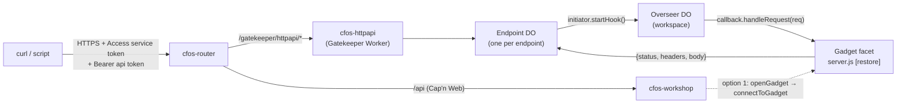

# Giving a gadget an HTTP API

Can a gadget expose a REST-style interface that a command line (curl, a script, another service) can call? Written 2026-09-23 against starter `main` 3157780 and the pinned submodule `cloudflare-os` e50a9058 (fork, `feat/websafe` on top of `starter-openrouter`). Paths without a prefix are relative to `cloudflare-os/`.

## Answer

There is no "publish this gadget as an API" switch. A gadget is a Durable Object facet with no route, no outbound network and no inbound HTTP. There are two native ways in, and one of them is the canonical one for this job:

1. **The platform's own RPC endpoint, `/api`.** The browser already reaches a gadget's `server.js` this way. A Node script can do the same (`authenticateFromCfAccess()` → `openGadget()` → `getGadget()` → `connectToGadget()`). It needs no platform changes, but it is Cap'n Web RPC rather than REST, and it only works with a person's Access login.
2. **A Gatekeeper that owns the HTTP endpoint and delivers each request to the gadget through a hook.** This is how the platform already brings in outside events: the Email gatekeeper takes inbound mail and the Scheduler takes timers. The router already sends `/gatekeeper/<name>/*` to any bound gatekeeper, the owner enables the hook in Connections, and every call is logged as an observation.

**Recommendation for gadget-specific automation: option 2, an "HTTP API" gatekeeper** (`packages/gatekeeper-httpapi`). Use option 1 for one-off admin scripts. Plan: [`../plans/gadget-http-api.md`](../plans/gadget-http-api.md). For shared, reportable organisational records, use the authoritative [Organisation datastores plan](../plans/organisation-datastores.md): Postgres behind a domain service with typed RPC and a versioned HTTP API. The earlier [records-service alternative](../plans/external-records-service.md) is superseded; PostgREST is optional and deferred in the replacement.



## What the platform gives us (evidence)

| Fact | Where |
| --- | --- |
| Router forwards `/gatekeeper/<suffix>/*` to the `GATEKEEPER_<SUFFIX>` service binding, `/api` to the Workshop, and everything else to the frontend assets. No other public routes. | `packages/router/src/index.ts:25-51` |
| `/api` is Cap'n Web: POST gives an HTTP batch session, Upgrade gives a WebSocket session. In Access mode it needs `Origin` equal to the site origin and a `cf-access-jwt-assertion` JWT **with an `email` claim**. | `packages/workshop-backend/src/server.ts:814-861`, `:875-892`; `access.ts:29-40` |
| `AuthenticatedApi.openGadget(id)` → `Overseer.getGadget(workpieceId)` → `GadgetClient.connectToGadget()` returns a stub for the gadget's server-side DO facet, the same object the iframe uses. | `packages/workshop-shared/src/api.ts:474`, `:1670`, `:3420-3428` |
| Gadgets have `globalOutbound: null`, no HTTP handler of their own, and bindings only to gatekeepers ("Gadget-to-gadget bindings are not supported yet"). | `docs/research/gadget-connectors-and-services.md` §1–2 |
| A hook works like this. The gadget passes a **persistent** stub (`ctx.restore(params)` handled by its `[restore](params)` method) to a gatekeeper session method. The gatekeeper calls `approvalQueue.bindHook(controller, callback, description)`. The hook starts **disabled**, and the owner enables it in Connections, which calls `controller.enable(initiator, target)`. To deliver, the gatekeeper calls `initiator.startHook()`, which returns `{callback, approvalQueue}`, then calls `callback.<method>(…)`. | `packages/workshop-shared/src/gatekeeper.ts:1234-1300`; `packages/workshop-backend/src/overseer.ts:3120-3180`, `:6955-6977`; agent prompt `agent.ts:621-680` |
| `startHook()` re-checks that the hook is enabled and that the vendor is not disabled in /admin, then attributes the call as `{from: "hook"}`. | `overseer.ts:6955-6977` |
| **Reference implementation:** the Email gatekeeper. `EmailSession.subscribe(callback)` → `bindHook`. `EmailHookControllerImpl` stores the initiator in a per-address DO that records its owner. On delivery it calls `startHook()`, `authorizeObservation()`, then `callback.receiveEmail()`. | `packages/gatekeeper-email/src/email.ts:482-700`, `README.md` |
| `ExternalMessageGateway.submitExternalMessage()` sends a *chat prompt* to a workspace's agent and gets the text reply back. It talks to the agent, not to gadget data. Chat's @agent uses it. | `packages/workshop-shared/src/external-message-gateway.ts`, `packages/workshop-backend/src/external-message-gateway.ts` |
| The starter already has an HTTP-serving gatekeeper behind Access (`/gatekeeper/chat/`, `packages/gatekeeper-chat/src/access.ts`) and a template for registering a vendor (`packages/gatekeeper-chat/src/vendor/`, `packages/gatekeeper-websearch`). `scripts/deploy.ts:641` and `:708-735` add the router and Workshop bindings. | starter |

## Options compared

| | How | Native? | CLI friendly | Auth | Verdict |
| --- | --- | --- | --- | --- | --- |
| **1. `/api` Cap'n Web client** | Node + `capnweb`: an HTTP-batch pipeline `authenticateFromCfAccess().openGadget(ws).getGadget(n).connectToGadget().someMethod(x)` | Yes, the frontend's own path | Medium. A script, not curl. Every `server.js` method is callable. | A person's Access JWT only (`cloudflared access login`). Service tokens have no `email`, so they are rejected. | **Good for admin scripts.** No new code on the platform. The API is whatever `server.js` exports, with no versioning or scoping. |
| **2. HTTP API gatekeeper + hook** | New Worker at `/gatekeeper/httpapi/e/<endpointId>/…`. The gadget registers a `handleRequest` hook. | Yes, the Email and Scheduler pattern | High. Plain REST and curl. | Access service token at the edge, plus a per-endpoint bearer token that the gatekeeper mints and checks | **Recommended.** Owner consent (hook enable), audit (observations), per-endpoint revocation, admin kill-switch. |
| 3. `ExternalMessageGateway` "CLI chat" | A gateway Worker with a `source` prop sends prompts to the agent | Yes | For *talking to the agent* | Trusts the gateway's `callerEmail` | Wrong tool. The answers are LLM prose, not data. |
| 4. Custom Worker that reads the Overseer DO directly | Bind `OverseerDurableObject` from another Worker | **No** | High | Your own | **Reject.** Skips sharing, approvals and the facet boundary, and breaks on every upstream change. |
| 5. Fork patch: an HTTP handler on the gadget | Teach the Overseer to forward `/g/<id>/*` to the facet | No (fork) | High | New | Only worth doing as an upstream proposal. Option 2 gets the same result without touching the kernel. |

## Constraints an implementation must respect

- **Throughput.** A gadget handles about 45–50 inbound RPC calls a second, one at a time, and every request also goes through the Overseer (`startHook`). This suits a control or data API, not a high-QPS public service. Add a per-endpoint rate limit in the gatekeeper.
- **Hook callbacks must be persistent stubs** made by `ctx.restore()` (or by `env.GADGET[restore]()` inside `executeCode`). A session `RpcStub` fails with "not a persistent stub". The gatekeeper must **never store `callback`**. It stores the `initiator` Fetcher and calls `startHook()` for every request (`gatekeeper.ts:1291-1300`).
- **Access covers the whole hostname.** A CLI either sends `CF-Access-Client-Id`/`CF-Access-Client-Secret` (a service token, with a Service Auth policy on the Access app) or uses `cloudflared access curl`. For third-party webhooks that cannot send headers, add a path-scoped Access app with **Bypass** for `/gatekeeper/httpapi/e/*`. The bearer token then becomes the only protection there.
- **Identity.** A hook call is `{from: "hook"}`: no person is signed in. The gadget receives the *token's* label and creator in the request object. It must not treat that as a signed-in viewer ([gadget-viewer-identity.md](gadget-viewer-identity.md)).
- **Values.** Request and response bodies cross Workers RPC. Cap them (about 1 MiB) and use strings or bytes. Remember V8 sizes are larger than JSON sizes (see the gotchas in [README](README.md)).
- **Stale stubs after a code edit** do not affect hooks. `startHook()` restores a fresh callback every time. This is one advantage over option 1's long-lived WebSocket.
- **RPC method names.** Avoid `connect` on any DO-backed stub (it is the built-in TCP method).

## Option 1, minimal shape (for reference)

```ts
// node >= 22, `pnpm add capnweb`; Access user token from `cloudflared access token -app=https://cfos.surprisingly.ltd`
import { newHttpBatchRpcSession } from "capnweb";
// The batch transport must send: Origin: https://cfos.surprisingly.ltd, cf-access-token: <jwt>
// (Access turns cf-access-token into cf-access-jwt-assertion at the edge). Check whether capnweb's
// batch session accepts a custom fetch/headers; otherwise wrap fetch or use the `ws` package with headers.
const api = newHttpBatchRpcSession<PublicApi>("https://cfos.surprisingly.ltd/api", /* headers */);
const result = await api.authenticateFromCfAccess().openGadget(WORKSPACE_ID)
  .getGadget(GADGET_ID).connectToGadget().listCards();   // one pipelined round trip
```

Not verified end to end. The capnweb header hook and the handling of a `cf-access-token` header still need to be proved against the deployment.

## Sources

- Code: the paths above. The pattern to copy is `packages/gatekeeper-email/src/email.ts`.
- Cloudflare Access service tokens: <https://developers.cloudflare.com/cloudflare-one/identity/service-tokens/>
- `cloudflared access` for CLI clients: <https://developers.cloudflare.com/cloudflare-one/applications/non-http/cloudflared-authentication/>
- Cap'n Web transports: <https://github.com/cloudflare/capnweb>
